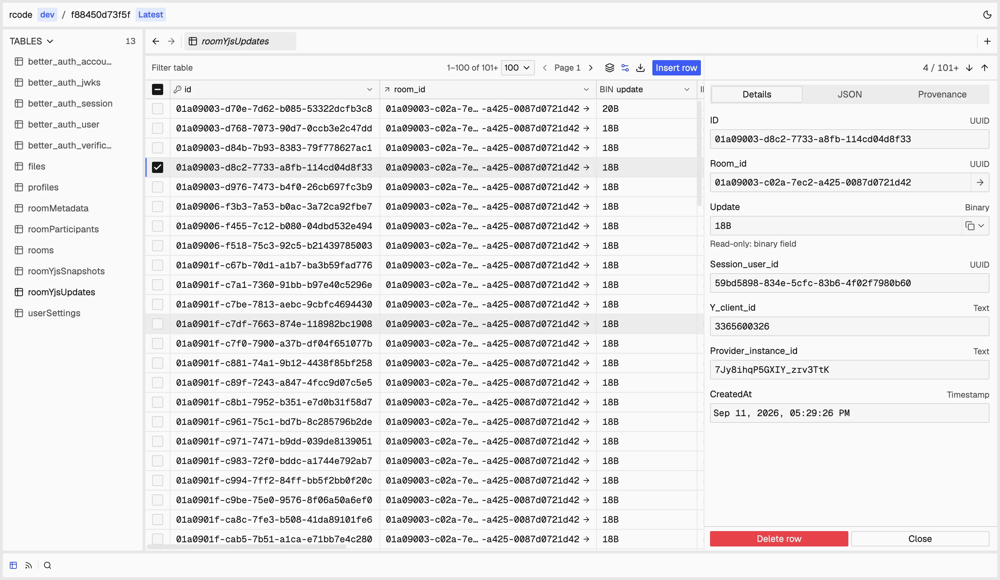

<p align="center">
  <picture>
    <source media="(prefers-color-scheme: dark)" srcset="./apps/studio/public/brand/inspektorWordmarkOnDark.png" />
    
  </picture>
</p>

<p align="center">
  <a href="https://inspektor.dev">Website</a> ·
  <a href="https://inspektor.dev/conn">Studio</a> ·
  <a href="https://github.com/cleminso/inspektor">Source</a>
</p>

<p align="center">
  <a href="./LICENSE"></a>
</p>

# Inspektor

Inspektor is a browser-based inspector for developers building Jazz applications.

Inspect your application's published schema and data without building a separate admin interface.

<p align="center">
  
</p>

Use [Inspektor Studio](https://inspektor.dev/conn) in your browser to inspect schemas and records, filter data, edit supported rows, and monitor live queries.

## Table of contents

- [Use Inspektor](#use-inspektor)
- [Credential storage](#credential-storage)
- [Local development](#local-development)
- [Validation](#validation)
- [Project documentation](#project-documentation)
- [License](#license)

## Use Inspektor

Inspektor is for Jazz developers who need to understand application data while they build and debug. It helps you inspect the published schema, browse tables and rows, review permissions, edit supported data, and monitor live queries.

Open [Inspektor Studio](https://inspektor.dev/conn) and create a connection with your Jazz server URL, app ID, admin secret, and environment. Inspektor loads the published schema from your configured server.

Inspektor follows the connection model used by the official [Jazz Inspector](https://jazz2-inspector.vercel.app).

## Credential storage

Connection profiles and workspace preferences are stored in the browser's local storage. Admin secrets are not. By default, an admin secret remains in memory and must be entered again after a refresh. Each connection can instead remember its secret in the current tab session. Credentials are used only with the configured Jazz server.

## Local development

Requires Node.js `^22.18.0 || ^24.11.0 || >=26.0.0` and pnpm `12.4.2`.

Install dependencies:

```sh
pnpm install
```

Start the Studio application:

```sh
pnpm dev:studio
```

For an isolated Jazz application, run the fixture in another terminal:

```sh
pnpm inspektor-test:fixture
```

Use the direct HTTP Vite URL when connecting to the fixture. The fixture prints ephemeral credentials for local use and deletes its data when stopped. See [Inspektor Test](./apps/inspektor-test/README.md) for its scenarios and security rules.

## Validation

Run the default workspace test suites:

```sh
pnpm test
```

Run standalone Playwright E2E tests against built applications:

```sh
pnpm test:e2e
```

Install the Playwright browser before its first local run with `pnpm test:e2e:install`. The `pnpm check` command does not run Playwright. For a focused Vitest suite, use `pnpm --filter <package> test`.

## Project documentation

- [Architecture](./ARCHITECTURE.md)
- [Knowledge graph](./lat.md/lat.md)
- [Frontend structure](./lat.md/frontendStructure.md)
- [Product design](./lat.md/design-document.md)
- [Implementation checklists](./todo/)
- [Specifications](./specs/)
- [Research](./research/)

## License

Inspektor is available under the [MIT License](./LICENSE).
