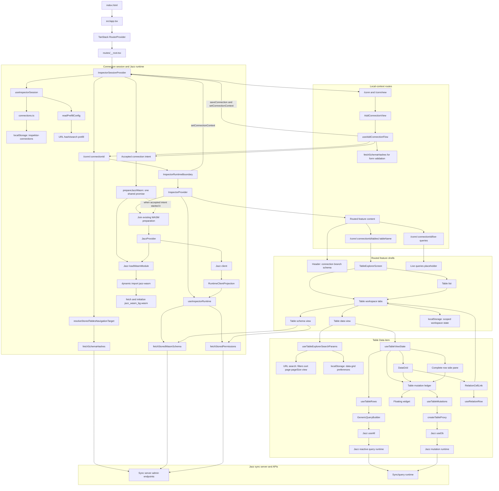

# Metadata

Author: Cleminso
Status: v1 - Working progress
Repo-URL: https://github.com/regardedev/inspector/
Doc-URL: https://github.com/regardedev/inspector/tree/main/docs/design-document.md
Audience: Project author and AI agents working on the implementation. Secondary, future contributors who want to understand
the product direction.

## Table of contents

- [Objective](#objective)
- [Background](#background)
- [Users](#users)
- [Goals](#goals)
- [Non-goals](#non-goals)
- [Architecture Diagram](#architecture-diagram)
- [Glossary](#glossary)
  - [Staged mutation lifecycle](#staged-mutation-lifecycle)
- [Known pain points](#known-pain-points)
- [Inspector](#inspector)
  - [Runtime bootstrap](#runtime-bootstrap)
    - [Accepted-intent WASM preparation](#accepted-intent-wasm-preparation)
    - [Startup chain](#startup-chain)
    - [Failure and ownership model](#failure-and-ownership-model)
    - [Runtime implementation map](#runtime-implementation-map)
- [User interface](#user-interface)
- [Scenarios](#scenarios)
- [Product states](#product-states)
- [Out of scope features](#out-of-scope-features)
- [Performances](#performances)
- [Attack surface](#attack-surface)

## Objective

Inspector is a local, schema-driven developer tool for Jazz applications. It helps developers inspect their app data,
schema, permissions, and active sync-server query subscriptions from one interface by directly talking to the sync system.

v1 continues the MVP direction with stronger UI/UX foundations, clearer interaction design, better performance, and more maintainable architecture.

By better implementation/performance I mean faster browsing, clearer data-grid interactions, stronger query subscription UX,
reusable UI foundations, and better state handling, so future inspector features can be added without becoming one-off
patches.

## Background

I'm a developer who loves Jazz-tools, a local-first relational database.

I'm using Jazz because they made my developer experience simpler to create applications with features I like such as
local-first, real-time sync. But during my developer experience there is the moment to use the inspector that I'm not
satisfied.

I found the inspector experience quality does not represent the same quality as Jazz-tools offer.

I want to build an alternative Jazz inspector that's focus on modern UX and easier to use and it's central piece for a Jazz developer that require attention and cares.

I'm making assumptions about the UX what I think is necessary for the inspector. The "UX quality" is my own judgment. My end
goal is to present this work to Jazz team and discuss to join them to work on the official inspector. I see myself working on frontend part of Jazz, such as the official inspector and Jazz dashboard.

The direction I take for this Inspector is quite different from the official one, who is more "standalone" about the framework used (pure css). Where I'm going with modern framework choice that I'm more comfortable with, and found more ergonomic. See Architecture

## Users

Primary users are Jazz app developers debugging local or development data. They understand their app schema, tables, and records, but need help seeing what the sync system stores and tracks.

## Goals

Capability tables in this document define the v1 required feature set. Items not required for v1 belong in Non-goals or Missing Features.

Make the data table the core product surface

- The data table helps developers read, filter, navigate, inspect, and edit Jazz app data.
- Redesign Live queries into a useful debugging surface
- Help developers understand what the sync server is tracking, which tables are involved, and how subscriptions relate back to app data.
- Establish durable UI and component foundations
- Evaluate whether lower-level base/ui primitives should replace parts of the current shadcn/ui usage when direct primitive control improves composition and maintainability.
- Improve product states across core flows. Use loading, empty, error, and success states when they help developers understand what is happening or recover from a problem.
- Raise visual and interaction quality
- Create a focused developer tool with clear hierarchy, calm surfaces with safe and precise interactions.

## Non-goals

Inspector v1:

- is not a generic database client. It is specific to Jazz concepts such as schemas, permissions, branches, sync-server query subscriptions, and admin client access.
- does not replace Jazz's in-app Inspector overlay. The standalone Inspector focuses on remote admin exploration, while the overlay focuses on an application's local identity, local store, and active development context. Their user experiences may share foundations without becoming the same product surface.
- does not generate or import app-specific query builders, table views, or custom admin screens
- remains schema-driven and generic.
- does not implement traces, logs, metrics collection, or a dedicated telemetry query endpoint. Those belong to a later telemetry-focused version.

## Architecture Diagram

## Glossary

**Inspector**

A local web React app that **connects directly to a Jazz sync server**. It loads schema metadata, creates an in-memory Jazz
admin client, and renders UI elements for developers to inspect their Jazz application, such as schema-driven tools,
filtering, mutating, and inspecting server query activity.

It is not tied to Jazz Cloud only. It is not driven by generated app-specific code.

**In-memory Jazz admin client**

A Jazz client acquired and managed through `JazzProvider` with `adminSecret` and `driver: { type: "memory" }`.

`adminSecret` gives the Inspector admin access to inspect schema metadata and app data. The memory driver keeps the Inspector
runtime local and non-durable, so inspected data is not persisted by the Inspector client between sessions.

**Connections**:

From a user perspective, a connection is a persisted admin session configuration with app credentials. It lets the inspector
introspect a remote server and fetch schema hashes, query subscriptions, and table data. Connections are stored in local
storage under `inspektor-connections`

From Jazz's perspective, a connection is a single active WebSocket transport link between client and server.

**Workspace context**

The selected connection, branch, and schema hash that define one Inspector runtime. The connection id stays in the route so a
browser tab can resolve its saved local connection. Branch is restored from the connection preferences. Schema hash is selected
from explicit `?schema=` URL state or the first advertised schema and remains visible in the header.

**Workspace item**

One open piece of primary content in the Tables workspace. Table Data, table Schema, and New View are explicit item kinds. Data
and Schema use one canonical tab identity per table. A tab is the visual handle for an item, while the active route owns the
displayed representation and search state.

**Representation**

The primary way a table workspace item presents a resource. A table has Data and Schema representations with distinct canonical
tab identities. Data is the default representation; `view=schema` selects Schema in the route.

**Application dock**

The application-level control region. Its Tables control opens or closes the Tables route's navigator pane. The Query
Subscriptions control is reserved for the separate Live queries route.

**Live queries**

Server-side subscriptions that Jazz tracks for active queries. They describe which table/query/branch combinations the sync
server is currently maintaining, not a local React state or a static query result.

From the Inspector perspective, query subscription telemetry helps developers understand which app reads are active on the
server and jump from a subscription record back into the data explorer when the query can be mapped to table filters.

A Jazz query subscription is a live query registered by a Jazz client. The query is forwarded to the sync system unless
marked local-only. The server tracks it, evaluates it against schema, permissions, branches, and policy context, then sends
matching row updates back as data changes.

**Sync Server**

The Jazz server that accepts admin introspection requests, stores published schema metadata, coordinates sync, and reports server-visible query subscription snapshots.

**Editing surface**

A schema-aware interface for changing values before persistence. Inline cell editors and the complete-row pane are editing
surfaces. They project the same table mutation state rather than owning independent persistence flows.

**Staged change**

A valid local update or confirmed deletion that has not been persisted to Jazz. Row-pane edits update the staged draft directly;
floating field edits become staged when the field is saved or completed. A staged change can be reviewed, removed, discarded, or
persisted through Apply changes.

**Mutation ledger**

The in-memory, table-scoped collection of staged updates and deletions. Each table has an isolated ledger identified by its
connection, branch, schema hash, and table name. The Inspector never combines changes from different tables into one Apply
operation.

### Staged mutation lifecycle

1. Switching rows, filters, pages, representations, tables, or workspace tabs preserves each table's staged changes.
2. Returning to a table restores its staged updates, deletions, recoverable invalid drafts, and failed Apply state.
3. A successful `Apply changes` or explicit `Discard` clears that table's mutation ledger.
4. Closing the final workspace tab representing a table with unresolved mutations opens an Alert Dialog. `Keep editing` cancels the
   close; `Discard and close` clears that table's ledger and closes the tab. Closing a tab never silently discards staged changes.
5. Changing the connection, branch, or schema requires the developer to resolve affected ledgers because their mutation scope is
   no longer valid. Confirming discard clears them; canceling keeps the current scope active.
6. Refreshing or closing the browser destroys the in-memory ledgers. The Inspector requests the browser's unload warning when
   unresolved mutations or recoverable invalid drafts exist; the browser controls whether it appears and all displayed copy.

**Floating widget**

The table-owned projection of staged mutation state. It presents validation, review, Apply, Discard, and mutation failures. A
centered application-dock trigger remains visible while the panel is expanded or collapsed, shows the staged count in leading
position, and communicates whether the table has staged changes or input that needs attention. Contextual deletion initiation and
confirmation remain in the complete-row pane.

**Apply presentation**

The Floating widget's final review state. It lists staged changes grouped as updates and deletions, then offers one
`Apply changes` action. Delete confirmation only adds selected rows to this staged collection; Apply changes remains the sole
persistence step.

**Invalid editor input**

Raw field input that failed schema-aware parsing or validation. It remains available for correction but does not enter the
mutation ledger. Collapsing the Floating widget preserves the input and exposes a `Needs attention` status.

**Apply changes**

The action that persists the current table's staged updates and deletions. A deletion-only operation uses the same Apply boundary
as a mixed update-and-deletion operation. Complete-row insertion persists through its pane's `Insert` action.

**Staged changes**

The dock trigger label for locally accumulated mutation state. The expanded widget uses `Review changes` for affected-row
disclosure, `Apply changes` for persistence, `Discard` for removal, and `Needs attention` for invalid input or failed execution.

## Known pain points

_First, the official Jazz Inspector is working, actions can be done and achieve the original purpose._

Some of my personal pain points, mostly about the UX and navigation inside the Inspector:

- navigation to switch connection
- never know which schema hash is the most recent
- lose context when browsing tables, following FK redirection
- missing dev oriented features, such as:
  - manual filter typing
  - keyboard actions
  - quick way to select and/or copy row/cell
- lack of clarity with `live-query` page
- official inspector folder is quite "messy" hard to make a contribution to

## Inspector

The web inspector is an app for Jazz developers to explore their application data. It loads published schema metadata, creates
an in-memory Jazz admin client, and renders generic schema-driven tools for reading, filtering, mutating, and inspecting
server query activity.

Because of this, the inspector can work with arbitrary app schemas without importing generated types from the target app.

The inspector is close to an **admin client talking to the sync system** rather than a purely local debug tool. It's for that the default durability/mutation tier is `edge`

To me, Jazz's in-app overlay and standalone Inspector answer different problems.

- The overlay joins the host application's local store and identity, which makes it useful for local and unsynced application state.
- THe standalone Inspector keeps an independant remote-admin workflow, switching connections, branches, and schema hashes then inspecting Live queries.

Standalone Inspector behavior is my product priority here.

### Composition

1. connection management
2. schema and permissions metadata loading
3. Jazz client bootstrap
4. schema-driven explorer
5. Live queries telemetry UI

## User interface

There is the list of screen and components that constitute the Inspector interface.

### Workbench

The Inspector shell keeps connection context separate from routed feature content. The Tables route owns the implemented
workspace model; the Live queries route is separate and does not share the Tables tab provider.

It follows this structure:

- Header: connection, branch, schema hash, and global controls.
- Application dock: controls global feature surfaces. The Tables control toggles the Tables navigator pane.
- Tables route: owns the Tables navigator, table workspace tabs, recent table views, and table mutation ledgers.
- Live queries route: owns Live queries content independently from the Tables workspace.
- Contextual panels: table-owned surfaces such as the complete-row pane support the active Data item without becoming another
  navigation mode.

The Tables tab strip contains canonical Data and Schema items plus New View. The Live queries workspace does not participate in this tab
model.

#### Routing and local context

Inspector routes describe the active content inside one saved local connection:

- `/conn/:connectionId/tables` opens the table workspace and selects an available table when needed.
- `/conn/:connectionId/tables/:tableName` opens the selected table. `view=schema` selects its Schema representation.
- `/conn/:connectionId/live-queries` opens the connection-scoped query placeholder.

Data is the default table representation, so the route omits `/data`. Schema representation, filters, sorting, page, page size,
and explicit schema hash remain search parameters. Routes do not expose tabs, open item order, or branch.

The connection id resolves one profile from `inspektor-connections`. Branch comes from the saved connection preference. Schema
resolution uses an explicit `?schema=` value when valid and otherwise selects the first advertised schema. Copied content URLs
remain dependent on the locally saved connection and never carry the admin secret.

Open table items, item order, recent views, and navigator state are local workspace state. The active route describes table
content and can recreate or focus its canonical item, but it does not make the visual tab part of the route model.

The focused routing decisions and examples live in [Inspector route structure](notes/routing.md).

### Connection management

Connection management is the entry point for developers to inspect their Jazz app. It enables developers to create a connection to Jazz server with their app credentials, select branch and schema.

The flow must prevent silent connection failure: if the Inspector cannot validate the connection and schema are valid, it should keep the user in connection setup instead of opening a broken dashboard.

This flow **must answer**:

- do I have any saved connections?
- which Jazz app am I about to inspect? which branch and schema version is it?
- are my credentials valid for this appId?
- if connection to server fails, what failed, and what do I need to fix?
  - is the server URL reachable?
  - does the `appId` match the credentials?
  - are there published schema hashes?

#### Non-goal

- Connection management is not account management.
- It does not manage Jazz Cloud projects.
- It does not discover apps automatically.
- It stores local developer credentials only.
- It does not persist schema payloads, only connection configuration.

#### User background when arriving here

1. First-time user
   - has a Jazz app
   - wants to establish a connection via the Inspector for the first time
   - has copied credentials manually or opened a prefill link
   - needs confidence that the connection points to the intended app
   - needs to understand which schemaHash is latest
   - may need to inspect older schema
2. Returning user
   - has saved connections
   - expects saved connections to reopen quickly
   - needs to know whether the saved connection is still valid
   - needs to know whether Inspector opened the latest schema or a previous one
   - may create a new connection and need to perform it quickly
   - may be surprised that a saved local connection still needs the local runtime/server running
3. Debugging wrong app
   - sees unexpected rows, missing tables, or no query subscriptions
   - needs to verify `serverUrl`, `appId`, `branch` and `schemaHash`
   - needs confidence that Inspector is attached to the same app/runtime they are debugging

#### How it works

From a user perspective, a connection is a persisted admin session configuration with app credentials. It lets the inspector
introspect a remote server and fetch schema hashes, query subscriptions, and table data. Connections are stored in local
storage under `inspektor-connections`.

From Jazz's perspective, a connection is a single active WebSocket transport link between client and server.

#### v1 required capabilities

| Capability                | Notes                                            |
| ------------------------- | ------------------------------------------------ |
| Add connection            |                                                  |
| Edit connection           | Revalidate and select from the returned schemas  |
| Browse active connections |                                                  |
| Connection switching      |                                                  |
| Delete connection         |                                                  |
| Connection prefill        | Populate the connection form from a URL           |

Must support:

- [x] add connection
- [x] edit connection
- [x] delete connection
- [x] switch active connection
- [x] switch schema hash within the active connection

#### First-run flow

1. User fills `AddConnectionForm` with connection credentials
2. It calls `useAddConnectionFlow` with `fetchSchemaHashes` to verify app credentials match
3. Once validated, user chooses one published schema hash
4. `app` persists the resolved connections

#### Connection switching

Once connected the users must be able to switch to another connection from anywhere in the inspector dashboard instead of going back to the home page.

#### Editing a connection

Editing a connection revalidates the updated credentials. One returned schema opens directly. Several returned schemas keep the
developer in the flow to select the schema before reopening the connection.

The schema switcher shows which schema hash is latest.

If validation fails, render the validation error and keep the edit form open. If the server returns no schema hashes, use the same error handling as the add-connection flow. Branch handling should follow the current connection/session behavior.

#### Prefill connection

Jazz dev tooling can print a direct Inspector link with connection fields in the URL. The Inspector parses query and fragment
parameters into the same draft used by the connection form. Fragment parameters avoid sending `adminSecret` in the Inspector
page request; query parameters remain supported for compatibility.

#### Saved connection availability

Saved connections persist credentials and preferences in local storage. They do not persist the stored schema payload or the
server's schema hash list.

Opening a saved connection still needs the Jazz server at `serverUrl` to be reachable when Inspector resolves schema hashes,
fetches the selected stored schema, and creates the admin client.

If the app dev server only produced the inspector link but the Jazz server is remote and still reachable, the saved connection
can open without the app dev server. If the app dev server owns the managed local Jazz runtime, stopping it makes the saved
connection unavailable until the runtime is running again.

When resolving `/conn/:connectionId`, Inspector reads the saved branch and fetches the available schema hashes. A valid explicit
`?schema=` value wins; otherwise Inspector selects the first advertised schema. A remembered schema is used only as a fallback
when schema discovery fails. Runtime bootstrap can still fail if the server cannot return the schema or create the admin client.

UI representation:

- Surface: connection list, add/edit connection form, schema switcher in the app shell.
- Primary controls: add connection, edit connection, delete connection, switch connection, switch schema hash.
- Primary content: connection name, server URL, app id, branch, active schema hash, latest schema hash.
- States: first run, validating credentials, invalid connection, no schemas, stale schema hash, connection deleted.

### Runtime bootstrap

#### Purpose

Runtime bootstrap turns a selected connection, branch, and schema hash into the active Inspector runtime. All data surfaces depend on this runtime.

#### Accepted-intent WASM preparation

Connection actions start `prepareJazzWasm()` only after the runtime-scope exit guard accepts the action and before navigation begins. This applies to saved-connection opening and accepted add or edit flows. The action does not await preparation, so route resolution and WASM initialization can overlap.

`jazzWasmPreparation.ts` owns one application-wide promise. It calls Jazz's public `loadWasmModule()` API and shares the same attempt across repeated accepted actions and React remounts. `InspectorProvider` joins that promise before mounting `JazzProvider`, preventing concurrent initialization against the installed Jazz version.

Direct URLs, refreshes, history navigation, and `InspectorRuntimeBoundary` session synchronization do not start preparation. If no accepted action created a promise, `InspectorProvider` mounts `JazzProvider` without an additional gate. This keeps direct route entry on Jazz's normal startup path.

#### Startup chain

1. An accepted pre-navigation connection action starts the shared WASM preparation without awaiting it. Direct route entry skips this step.
2. The parent connection route resolves the saved connection and branch, then awaits schema-catalogue discovery. A remembered schema hash remains usable when discovery fails.
3. `InspectorRuntimeBoundary` synchronizes the route-resolved connection, branch, and schema hash with session state before mounting `InspectorProvider`.
4. `useInspectorRuntime(...)` starts stored-schema verification and optional permissions loading as sibling work.
5. `InspectorProvider` waits only when accepted intent already started WASM preparation, then mounts `JazzProvider` with `adminSecret` and `driver: { type: "memory" }`.
6. Jazz loads its JavaScript glue, fetches and initializes `jazz_wasm_bg.wasm`, and creates the in-memory admin client. Jazz owns URL resolution, streaming instantiation, client acquisition, and shutdown.
7. `RuntimeClientProjection` publishes the client only after stored-schema verification succeeds.
8. The table view acquires its Jazz query subscription. Useful rows render after the first query callback.

Table mounting does not preload CodeMirror. A structured editor mount starts the deferred editor import and exposes a controlled, geometry-stable textarea until CodeMirror replaces it. Data-grid reordering remains optional post-mount work so the first configured drag can begin without putting DND in the static application graph.

#### Failure and ownership model

- Missing connection, branch, or schema hash clears the runtime.
- Client creation failure is fatal for the active session.
- Stored schema fetch failure is fatal for the active session.
- Schema hash fetch failure blocks schema-switching context.
- Permissions fetch failure is non-fatal; the UI can continue without permission hints.
- Early WASM preparation is best effort. Its failure settles the shared gate; `JazzProvider` remains the authoritative loading, error, and retry owner.
- When the user changes connection, branch, or schema hash, stale async work is ignored and the previous client is shut down.

#### Runtime implementation map

- `apps/web/src/app/providers/inspectorSessionProvider.tsx`: accepts connection intent, applies runtime-scope blocking, starts WASM preparation, and requests navigation.
- `apps/web/src/features/onboarding/useAddConnectionFlow.ts`: validates connection input and joins accepted add or edit flows to the same preparation boundary.
- `apps/web/src/app/runtime/jazzWasmPreparation.ts`: owns the shared best-effort `loadWasmModule()` promise.
- `apps/web/src/routes/conn/$connectionId.tsx`: resolves the route-owned runtime target before mounting runtime code.
- `apps/web/src/app/runtime/inspectorRuntimeBoundary.tsx`: synchronizes the resolved target with session state without starting preparation.
- `apps/web/src/app/providers/inspectorProvider.tsx`: joins existing preparation, owns `JazzProvider`, and publishes the verified client.
- `apps/web/src/app/runtime/useInspectorRuntime.tsx`: owns stored-schema, permissions, runtime error, and client projections.

#### Why memory driver

The Inspector creates a local admin client with `driver: { type: "memory" }` because it needs live Jazz runtime behavior without persisting inspected app data in the Inspector client.

### Table explorer

The Table Explorer is the main interface for inspecting Jazz app data. It turns stored schema metadata into a table UI where developers can read rows, filter data, follow references between tables, perform mutation operations.

This flow **must answer**:

- Which table am I inspecting?
- Which rows match the current filters and sort?
- Is the table empty, or did my filters hide the rows?
- What is the full value behind a truncated cell?
- Which fields are relations, and where do they point?
- Which row is selected?
- What changed while I was looking at this table?
- Can I safely edit this row, and what happened if the mutation failed?
- Am I seeing a stable page of data or a live update?

#### User background when arriving here

1. Debugging app data
   - wants to know whether expected rows exist
   - wants to inspect exact stored values
   - wants to verify app UI actions are recorded
2. Following column relationships
   - starts from one row
   - needs to follow relation ids or foreign-key into related tables
   - needs to keep context instead of losing original table
3. Testing setup
   - wants to insert or edit rows for local/dev testing
   - needs mutation errors to be clear and recoverable
4. Large-table browsing
   - needs predictable and controllable table loading
   - needs filters, pagination, and stable selection
   - should not lose context because live data changes

#### v1 required capabilities

| Capability              | Notes                                                                          |
| ----------------------- | ------------------------------------------------------------------------------ |
| Read rows clearly       | Cell rendering based on column type, column labels, truncation, copy behavior  |
| Browse large tables     | Page-windowed loading with row-count controls                                  |
| Filter rows             | Existing generic filter builder, validation, visible active filters            |
| Select and inspect rows | Side panel, select state, row details                                          |
| Foreign-key relation    | Relation cells between tables, missing relation handling, workspace items      |
| Expose schema context   | Column types, references, nullable/required state, permissions display         |
| Edit existing rows      | Side-panel edits with validation and unsupported type handling                 |
| Insert rows             | Required fields, defaults, validation, permission hints                        |
| Delete rows             | Destructive confirmation with reversible staged deletion before Apply          |
| Show live row updates   | React to Jazz row changes without forcing a manual refresh                      |

#### Tables navigator

The Tables navigator is the entry point into table workspace items. It occupies the route-owned left pane when the application
dock's Tables control opens it. It helps developers find the table they want to inspect.

It answers:

- What tables exist in the selected schema?
- Which table is currently selected?
- Does the schema contain any tables?

v1 keeps this surface simple. The table list is navigation, not a full schema browser. Deeper schema details live in a table
Schema workspace item.

When the inspector opens for the first time, the Tables navigator can open the first available table as a Data workspace item.

If no workspace item is open, the main workspace renders an empty state instead of a table toolbar. That empty state can show
recently opened items so the developer can reopen prior work quickly.

**Table action item**

A table action item can be checked when hovere via a checkbox component that replace the leading table icon. Click right open a menu of actions (open x tabs; close x close; pin x tables; deselect all)

Selection rules

- Normal click:
  - Toggle only the clicked item
  - Replace the anchor with that item
- Shift-click with a valid visible anchor:
  - Find anchor and target indices in the visible table section
  - Take the inclusive range
  - Apply the target checkbox’s new state to the complete range
  - Preserve the original anchor so another Shift-click can extend the range
- Shift-click without a visible anchor:
  - Treat it as a normal click and establish a new anchor
- Shift-unchecking:
  - Uncheck the inclusive range

A ref is suitable for the anchor because changing it does not affect rendering. Checked names remain React state because they affect the UI and bulk commands.

Accessibility

- Shift+Space on a focused checkbox should use the same range logic
- Per-item :focus-within should reveal the checkbox just like hover
- Checkbox and navigation trigger remain siblings
- The checkbox receives the click without activating the table link

#### Workspace items and saved table state

Table workspace items follow this model:

- one tab represents one workspace-item instance
- a workspace item has an explicit resource and representation instead of inferring its meaning from its id
- clicking a table in the Tables navigator opens or focuses its default unfiltered Data item
- each table has one canonical Data item; filters, sorting, page, and page size update that item's route and stored search state
- clicking a relation opens or focuses the referenced table's default unfiltered Data item
- the Data toolbar can open or focus a Schema item for the same table
- Schema uses a distinct item kind and icon; it is not encoded as Data search state
- equivalent open-item requests focus the existing item instead of creating indistinguishable duplicates
- open items and recently opened items are persisted as workspace state scoped by connection, branch, and schema hash
- the active content route is URL-backed without exposing tab identity
- filters, sort, page, and page size are URL-backed for the active Data item and also saved in workspace state
- data-grid column state is saved per table
- saved items for tables missing from the selected schema are removed during workspace reconciliation
- a content route for a table missing from the selected schema opens New View instead of running a table query

State split:

- URL: connection id, schema hash, active table, representation, filters, sort, page, and page size
- localStorage: connection preferences, open table items, recent table views, item search state, navigator state, and saved
  data-grid order and visibility preferences
- memory: transient row and cell selection, mutation ledgers, mutation feedback highlights, and row editor focus

Do not add sessionStorage unless a specific table state needs to survive route navigation without surviving a browser restart.

Workspace-item tab actions:

- close
- keep open when the active item is replaceable

UI representation:

- Surface: Tables panel inside the route-owned left pane.
- Primary controls: table selection, pinning, and bulk open.
- Primary content: schema table names and active item relationships.
- States: loading schema, no tables, and no open workspace item.

#### Data table

Detailed row selection, cell selection, side-pane, column-selection, and bulk-edit behavior lives in the focused
[Table Explorer selection and pane behavior specification](./tableExplorerBehaviors.md). This document retains the product and
architecture summary; the focused specification owns interaction scenarios and unresolved behavior decisions.

The data table is the core product surface of the Table Explorer. It is read-first and record-oriented. `DataGrid` is the
consistent name for the reusable design-system renderer and table surface. `DataGrid` names the spreadsheet behavior layer for
opening complete multi-cell selections, column operations, matrix copy and paste, bulk cell editing, and complete keyboard cell
navigation.

Most Table Explorer actions converge in the data table. It brings row reading, filtering, selection, relation navigation,
schema context, and safe edits into one coherent surface.

The data table does not become table-specific UI. Special behavior comes from schema metadata or generic Inspector rules.

`@inspector/ds` owns the reusable `DataGrid` presentation system and its explicit TanStack Table feature registry. `apps/web`
owns the Inspector composition, TanStack table construction, Jazz queries, schema-derived columns, filters, relations, routes,
and mutations. The design-system root receives a controlled feature-aware `DataGridTable<TData>` instance rather than receiving
duplicate data, columns, sorting, pagination, or selection state.

The design-system API uses compound parts so consumers can compose the required structure without styling escape hatches:

- `DataGrid.Root`
- `DataGrid.Viewport`
- `DataGrid.Header`
- `DataGrid.HeaderRow`
- `DataGrid.HeaderCell`
- `DataGrid.Body`
- `DataGrid.Row`
- `DataGrid.Cell`
- `DataGrid.Empty`
- `DataGrid.Loading`
- `DataGrid.Footer`

These parts own semantic table markup, StyleX styles, focus presentation, state attributes, and constrained variants. Consumers
provide application content and state but do not receive `className`, inline `style`, raw CSS values, or broad styling slot
overrides. A standard renderer can iterate TanStack header groups, rows, and visible cells, while manual compound composition
supports advanced consumers such as expanded Query Subscription rows.

The replacement starts from a fresh design-system table surface rather than wrapping or restyling the deprecated renderer. The
rewrite preserves application logic that already has the correct ownership: stored-schema interpretation, generic Jazz query
construction, URL state, table preferences, relation navigation, and mutation parsing. Deprecated rendering components and
layout CSS are removed only when the new table can render a complete read-only slice.

v1 uses page-windowed table browsing. Virtualization can still render the current page efficiently, but the product model is pagination.

Interaction state keeps these concepts separate:

- the active column is the transient column inspection target
- the focused cell is the anchor of the latest TanStack cell-range operation and receives the strongest cell focus treatment
- selected cells resolve from ordered rectangular include and exclude operations against the displayed row and column order
- selected rows are the checkbox-controlled, page-local bulk operation set
- the focused row is the selected row represented by the row side pane

Selection, inline editing, side-pane presentation, and pending mutations are independent. A cell can be focused without opening
an editor, a multi-cell selection can be assembled before the user chooses an operation, and pending changes can remain after an
editing surface closes. The side pane uses an explicit presentation model:

- `closed`: no side pane
- `insert`: the schema-driven insert form
- `rows`: checked row ids and one focused row rendered by the complete-row editor

Single-clicking a cell focuses it without opening an editor or changing the pane. With the complete-row pane closed,
double-clicking an editable scalar cell or pressing Enter opens the schema-appropriate editor in the Floating widget without
requiring row checkbox selection. JSON, Array,
and Row values use the widget's
expanded code editor. Relation and binary cells open the complete-row pane focused on their field. Timestamp cells use an inline
calendar editor when that control is available. Generated, unsupported, and otherwise read-only cells remain read-only in the
grid; their complete representation remains available through the complete-row pane.

Save or a spreadsheet completion key validates editor input. Valid input becomes a pending change automatically; there is no
`Stage change` action and Save does not persist to Jazz.
Malformed input receives immediate colocated feedback, remains available for correction, and does not enter the mutation ledger.
After a valid cell edit joins the ledger, focus returns to its originating grid cell.

Command/Control interaction includes a range when it starts outside the selection and excludes a range when it starts inside,
while Shift interaction extends the latest rectangle from its fixed anchor. Multi-cell copy and mutation actions remain explicit
operations and do not open an inspection-only cell pane.

Clicking checkboxes individually builds the checked-row set. TanStack's row-selection handler owns the checkbox anchor and selects
the visible range when another checkbox is Shift-clicked. The application chooses the focused row and opens the complete-row editor
for the checked-row set. Previous and next controls navigate checked rows in active query order, while edit actions remain scoped
to the focused row unless explicitly labelled as bulk actions.
Insert remains a separate pane mode with direct `Insert`, `Discard`, and `Insert more` controls. Successful `Insert more` resets
and retains the form; insert drafts never enter the pending ledger. Unless an open nested control consumes Escape first, Escape
closes an open row pane and unchecks every checked row while preserving staged changes. Clearing the checked rows closes
selection-only widget state. With no pane open, Escape clears cell selection, cell focus, and column focus.

Closing a pane through Escape unchecks every checked row. Filter, sort, page, table, or schema changes clear row and cell selections. Column
reorder preserves range corners and recomputes the rectangle in displayed order. Hidden columns contract or suspend affected
ranges without deleting their operation state. Loading more rows preserves existing ranges because stable row IDs and explicit
query-scope resets define the selection lifecycle.

Pane dismissal and mutation discard are distinct. Escape dismisses the pane and unchecks every checked row while preserving
pending changes. Reverting one staged cell removes that field overlay; reverting a row update resets its
provider-owned row form to captured source values. `Discard` belongs to the Floating widget and removes pending changes from the current
table ledger. Numeric row and column coordinates can support developer orientation, but row IDs and column IDs remain the
selection identity.

The table mutation provider owns draft orchestration and validation. The complete-row pane owns contextual deletion initiation and
confirmation. The Floating widget projects mutation review, Apply, Discard, deletion review, and mutation failures. The pane and
grid are editing projections of the provider state. Several rows and columns in one table can accumulate pending changes. The
Tables workspace owns table-scoped ledgers, so switching table views preserves unresolved state for each table.

A focused cell receives the selected-cell background and blue focus border without changing its whole row background. A checked
row uses the selected-row background without an additional row border. The focused checked row adds a distinct blue focus edge.
The complete checkbox cell is the checkbox hit area: pressing empty space inside it toggles selection and opens the complete-row
editor rather than focusing a data cell.

Clicking a column header clears cell focus and selection, then activates and highlights that column and its visible cells. Clicking
the active header again, pressing Escape, clicking a cell, or pressing elsewhere in the interface clears the active column. Focus
remains visible independently of color. Active column, active cell, checkbox selection, pending-change state, validation state, and
live-update highlights use distinct semantic states so one highlight does not imply several meanings.

Pane and inline editing are simultaneously available rather than selected through a workspace preference. Row checkbox selection
opens the complete-row pane; cell double-click or Enter starts the schema-appropriate editor or routes to the complete-row pane
for relation and binary fields. Both surfaces use the same parsing, validation, dirty tracking, pending-change,
Apply, and Discard behavior through the table mutation ledger.

Scalar field completion follows spreadsheet navigation. Enter moves focus down in the same visible column. Tab and Shift+Tab move
horizontally and wrap across rows. Completion saves the field and closes the editor without opening the next cell. Escape discards
the uncommitted field input, preserves any previously staged value, and returns focus to the originating cell.

Columns use schema-aware initial widths rather than one width for every value. Boolean and numeric columns start narrow; ids,
relations, timestamps, text, and structured values receive progressively wider defaults. Header resize handles update TanStack
column-sizing state within constrained minimum and maximum widths. A double-click on the handle resets the schema-derived
width. Resized widths remain in the mounted TanStack table state and reset when that table state is recreated.

Data columns can be reordered by dragging their header horizontally. A short movement threshold preserves normal header clicks,
and interactive header controls such as checkboxes, resize handles, and menu actions do not start dragging. TanStack column-order
state is the single rendered-order authority. The drag layer identifies the reorderable subset, shows a detached preview, and
publishes one complete TanStack order only after a successful drop; canceled and in-progress drags do not publish transient table
orders. Column order is persisted with the other table preferences and normalized when schema columns are added or removed. The
checkbox column remains fixed at the leading edge and is not part of the draggable order.

Cell context menu:

- copy cell value
- copy row
- filter by value
- edit row
- edit selected cells when a supported bulk operation exists

`Filter by value` completes the FilterBar with the clicked cell value. The default operator is `eq`, and the user can still change the operator before or after applying the filter.

Column selection is an explicit header context-menu action rather than a normal header click. Each column operation must state
whether it targets visible cells or every row matching the active query. Visible cells form a table selection; every matching row
is a separate query-backed bulk operation.

Column-header, row, and cell context menus use the design-system `ContextMenu` component. `DataGrid` identifies the interaction
target; `apps/web` derives available actions from the Jazz schema, row state, and navigation context.

UI representation:

- Surface: main center table surface.
- Primary controls: filters, pagination, row-size selector, refresh, insert row.
- Primary content: rows, columns, active row/column/cell state, relation cells, checkbox selection, and mutation feedback highlights.
- States: loading, no open Data item, empty table, filtered-empty table, unsupported field display, recently applied cells, recently inserted rows, and stale live data.

#### Column type rendering

Column headers render compact type markers from Jazz schema metadata. The marker should describe the Jazz DSL type first; semantic formatting such as email, URL, image, or currency can be layered on later only when the schema exposes enough metadata to identify it safely.

The type marker composes a base type, container, and modifiers rather than treating every combination as an independent visual
type. Optionality changes null handling around the base renderer. A transform does not receive its own value renderer; the
effective value uses the appropriate base renderer, while schema details disclose the transform when it affects filtering,
editing, copying, or round-trip safety.

Header markers compose these dimensions directly, including forms such as `T?`, a relation icon with `?` or `[]`, `{T}`, and
`T FX`. The compact symbol remains secondary to the column name and exposes an accessible Jazz type label. The synthetic Jazz row
ID uses a key icon, references use a relation icon, and stored UUID values use `ID`.

| Symbol               | Jazz DSL type              | TypeScript value      | SQL storage         | Notes                                                                 |
| -------------------- | -------------------------- | --------------------- | ------------------- | --------------------------------------------------------------------- |
| `T`                  | `s.string()`               | `string`              | `TEXT`              | Plain text. Do not infer semantic text types from the SQL type alone. |
| `?`                  | `.optional()`              | base type or `null`   | nullable column     | Modifier badge, not a standalone type.                                |
| `#`                  | `s.int()`                  | `number`              | `INTEGER`           | Whole numbers.                                                        |
| `F`                  | `s.float()`                | `number`              | `REAL`              | Floating-point numbers.                                               |
| `B`                  | `s.boolean()`              | `boolean`             | `BOOLEAN`           | True/false values.                                                    |
| `TS`                 | `s.timestamp()`            | `Date`                | `TIMESTAMP`         | Render relative and absolute time where useful.                       |
| `BIN`                | `s.bytes()`                | `Uint8Array`          | `BYTEA`             | Binary data. Prefer Files & Blobs patterns for uploads and images.    |
| relation icon        | `s.ref("table")`           | row ID `string`       | `UUID` foreign key  | Relation to another table. Ref columns must end in `Id` or `_id`.     |
| `[]`                 | `s.array(type)`            | array of base type    | base SQL array      | Render as an array container with the nested type marker when known.  |
| relation icon + `[]` | `s.array(s.ref())`         | row ID `string[]`     | `UUID[]`            | Relation list. Ref array columns must end in `Ids` or `_ids`.         |
| `ID`                 | stored UUID                | UUID `string`         | `UUID`              | UUID value without relation metadata.                                 |
| `E`                  | `s.enum("a", "b")`         | string literal union  | `ENUM(...)`         | Show allowed values in details, not the compact header.               |
| `{}`                 | `s.json()`                 | `JsonValue`           | `JSON`              | Untyped JSON; replace whole value on write.                           |
| `{T}`                | `s.json(schema)`           | schema-inferred value | `JSON`              | Typed JSON; still atomic on write.                                    |
| `FX`                 | `.transform({ from, to })` | transformed value     | underlying SQL type | Modifier badge. Filters use the stored column value.                  |

The synthetic row ID is not part of the stored column descriptor and renders with a key icon. Transform markers require a safe
transform descriptor from the inspected application because stored WASM schema metadata does not contain transform information.

#### Row reading and cell rendering

Rows are readable before they are editable.

Cells render values based on type and context:

- short primitive values can render inline
- long strings are truncated with a way to inspect/copy the full value
- JSON-like values are readable and copyable
  - data table shows truncated preview
  - side panel shows editable textarea when safely serializable
- binary values are not editable text
- relation values use relation cell rendering when schema metadata provides a reference
- relation values use `TextLink` with a trailing arrow; text uses the normal foreground color and changes to link color on
  hover or keyboard focus without adding an underline
- timestamps are formatted for reading while preserving the raw value when copied

The goal is not to make every cell interactive. The goal is to make every cell understandable.

Grid cells use bounded, schema-derived previews. The grid does not serialize complete structured or binary values into a cell,
and it does not replace stored identifiers with inferred semantic labels. The complete-row pane is the authoritative surface for
complete values, alternate representations, copying, validation, and editing. Cells do not open hover cards or a separate
inspection-only pane.

Double-click or Enter starts the schema-appropriate inline editor in the Floating widget. Structured values use an expanded code
editor with Cancel and expand actions. Completing a valid edit adds it to pending changes automatically. Expand opens the
complete-row pane focused on the field. Relation and binary values open the complete-row pane directly. Timestamp values use an
inline calendar when available. Read-only values remain read-only in the grid.

| Condition                      | Grid representation                                                                                 | Side-pane representation                                                                                         |
| ------------------------------ | --------------------------------------------------------------------------------------------------- | ---------------------------------------------------------------------------------------------------------------- |
| Row ID                         | Full ID at the schema-derived initial width. Middle-truncate only when the user narrows the column. | Read-only input group with the complete ID and Copy action.                                                      |
| Non-empty string               | Text with end truncation when it exceeds the available width.                                       | Auto-growing text control with native text selection and clipboard behavior.                                     |
| Empty string                   | Explicit `""` so it cannot be mistaken for `NULL`.                                                  | Empty editable text control.                                                                                     |
| Integer                        | Right-aligned whole number.                                                                         | Numeric text input with integer parsing and validation.                                                          |
| Float                          | Right-aligned readable number; preserve full precision outside the compact preview.                 | Numeric text input that preserves intermediate editing states and validates finite values.                       |
| Boolean                        | Non-interactive boolean indicator with `true` or `false` text.                                      | `ToggleGroup` with `True` and `False`; add `Null` when optional.                                                 |
| Valid timestamp                | Absolute date and time in the browser timezone without fractional seconds.                          | Date-time field plus browser-local, UTC, relative, and raw epoch representations.                                |
| Malformed timestamp            | Explicit invalid-value treatment with the raw value preserved.                                      | Raw value, validation message, and no misleading date formatting.                                                |
| Non-empty bytes                | Byte count only, such as `317B` or `2KB`.                                                           | Read-only input group with byte count and a `Copy as` menu for Hex, Base64, and Download raw.                    |
| Empty bytes                    | `0B`.                                                                                               | Read-only input group with `0B`; binary actions remain available when meaningful.                                |
| Resolved reference             | Stored relation ID as a `TextLink` with a trailing arrow.                                           | Editable raw relation ID when writable, target table, resolved display value, Copy ID, and Open target.          |
| Missing reference target       | Stored relation ID with a missing-target state; never replace it with an empty label.               | Editable raw relation ID when writable, target table, missing-target message, and Copy ID.                       |
| Scalar enum                    | Plain enum value.                                                                                   | `Select` constrained to schema values.                                                                           |
| Malformed enum                 | Raw value with an invalid-value treatment.                                                          | Current raw value, schema options, and validation message without silent replacement.                            |
| Empty array                    | `[]`.                                                                                               | Empty structured array editor in `Details`; read-only expandable array in row `JSON`.                            |
| Primitive array                | Item count and bounded one-line preview, such as `[3] reader, writer, reader`.                      | Schema-derived repeatable fields when practical, with JSON text editing as the generic `Details` fallback.       |
| Enum array                     | Item count and bounded enum preview.                                                                | Repeatable `Select` rows that preserve order and duplicate values.                                               |
| Reference array                | Item count and bounded raw-ID preview.                                                              | Repeatable relation fields with raw IDs and explicit navigation actions.                                         |
| Empty JSON object              | `{}`.                                                                                               | JSON text field in `Details`; read-only expandable object in row `JSON`.                                         |
| Untyped JSON                   | Key or value count plus bounded one-line preview.                                                   | JSON text field with parsing feedback in `Details`; read-only expandable object or array in row `JSON`.          |
| Typed JSON                     | JSON summary with the `{T}` marker and bounded one-line preview.                                    | JSON text field with schema-derived validation in `Details`; read-only expandable object or array in row `JSON`. |
| `NULL`                         | Explicit subdued `NULL` marker.                                                                     | `NULL` control layered around the base editor.                                                                   |
| Unavailable value              | Explicit unavailable marker rather than an empty cell.                                              | Unavailable explanation and disabled field actions.                                                              |
| Unsupported or malformed value | Raw bounded preview with an invalid or unsupported state.                                           | Raw value, schema expectation, and reason the value cannot be represented or edited safely.                      |

Timestamp display uses the user's browser timezone, available through the browser's internationalization APIs. The sync server's
deployment location does not determine display timezone and cannot be inferred reliably from a timestamp or server URL. UTC and
the raw epoch remain available in the side pane. Relative time is supporting information rather than the primary grid value.

Reference details in the side pane show the target table, the complete stored relation ID, a resolved display value when one is
available, and whether the target row was found. Clicking the relation keeps the existing navigation behavior. Showing the stored
ID as the primary grid value preserves database truth, exposes broken references, and avoids making asynchronous target-row
resolution look like the stored value. Writable reference fields accept direct row-ID input and may add generic target lookup;
synthetic row IDs remain read-only.

Jazz byte values are `Uint8Array` values stored as SQL `BYTEA`. Because a byte sequence has no canonical clipboard text form,
binary copy commands name the encoding explicitly. Hex supports byte-level debugging and Base64 supports transport through APIs
and text formats. PostgreSQL literals and JavaScript indexed-object serialization are not primary Inspector representations.

Reusable, type-specific presentation and editor components belong in `packages/design-system`. The components remain independent
from Jazz schema objects: they receive constrained display values, metadata, states, and callbacks. `apps/web` owns the mapping
from Jazz schema metadata to those components, relation resolution and navigation, parsing, validation, and mutation behavior.
Dedicated design-system components are required for binary preview and inspection, timestamp presentation and date-time editing,
structured-value preview and JSON viewing, and relation presentation and field actions. Primitive text, numeric, boolean, enum,
copy, and null controls should compose existing design-system components unless a repeated semantic contract justifies a dedicated
component.

The row side pane has two representations:

- `Details` is the schema-derived insert and edit form. Field labels show Jazz semantics such as `string`, `timestamp`, `bytes`,
  `ref → rooms`, and `json<typed>` rather than SQL storage labels.
- `JSON` is a read-only, syntax-colored structured tree inspired by Geist JSON View. It expands top-level fields initially,
  supports branch disclosure, keyboard tree navigation, search highlighting, selectable text, and whole-row Copy JSON. The row
  JSON representation is not an editing surface; all row mutations remain in `Details`.

The structured tree is an independent design-system component. It owns bounded tree presentation, expansion, keyboard behavior,
focus, accessible tree semantics, and highlighting. `apps/web` normalizes Jazz values, owns the copy representation, and supplies
explicit representations for timestamps, bytes, references, unsupported values, and exhausted rendering budgets. Binary values
must not become indexed-object `Uint8Array` serialization in the JSON representation.

Editable controls keep normal form semantics: one click focuses and positions the caret, and double-click remains normal text
selection rather than entering edit mode. Read-only identifiers can expose a Copy suffix, and binary fields expose `Copy as`.
When an editable field is nullable and suffix space is constrained, the `NULL` control takes precedence over Copy; users can copy
editable text through normal selection and platform clipboard commands.

#### Browsing large tables

The MVP uses incremental loading. v1 replaces this with page-windowed browsing.

The browsing model prioritizes:

- stable page boundaries
- fast first useful render
- predictable loading boundaries
- clear difference between loading, empty, and filtered-empty states
- no avoidable reloading when selection, filters, or column visibility changes

Inspector uses Jazz `limit` and `offset` directly:

- `limit(pageSize + 1)` detects whether another page exists
- `offset(pageIndex * pageSize)` selects the current page window
- sorting must be deterministic before pagination so the same query returns a stable row order before applying `limit` and `offset`
- the UI does not show exact total records unless Jazz exposes a reliable count

Controls:

- previous page
- next page
- rows per page

Defaults:

- default page size: 100 rows
- page size options: 100, 500, 1000
- default sort: stable `id` order
- page and non-default page size: URL-backed and saved with the canonical Data item

If a requested page has no rows, Inspector returns to the first page.

Avoid exact `Page X of Y` and exact record counts for v1 unless Jazz exposes a reliable count.

Side-panel row focus is row-id based while its query scope remains active. Checkbox selection is page-local and clears when page,
filters, or sort changes.

#### Selection and row inspection

Clicking a row checkbox opens a side pane that gives the developer a focused place for reading and editing checked rows. Clicking
additional checkboxes extends that row set, while one checked row remains focused and is represented as a position such as
`2 / 4`. Single-clicking a data cell focuses it without opening an editor. Double-clicking starts inline editing for scalar and
structured fields, opens the complete-row pane for relation and binary fields, and leaves unsupported read-only values unchanged.
The focused behavior specification defines the detailed transitions and visual precedence.

The side panel answers:

- Which row am I editing?
- What are the full field values?
- What fields changed?
- What validation errors exist?
- What happened after Apply?
- Which values are read-only?

The active row remains stable when possible. Filtering, sorting, or refreshing data does not make the user lose context
without a clear reason.

Opening the row pane renders all schema fields, including fields hidden from the table, and focuses the active row rather than
treating every checked row as one implicit bulk mutation. An expanded structured inline editor can open this pane and target its
field without introducing a separate cell-inspection pane.

UI representation:

- Surface: right side panel attached to the active table view.
- Primary controls: close panel, edit fields, delete row, copy row, open relation target.
- Primary content: active row id, field list, full values, relation targets, schema hints, pending values, and validation errors.
- States: no active row, active row loading, clean row, pending changes, invalid input, mutation rejected, row missing after refresh, unsupported read-only field.

Pane and inline controls consume one application-owned mutation model. It separates the latest live source rows from dirty field
overlays, preserves pending values across live updates, reflects live values for untouched fields, and applies sparse dirty-field
patches rather than reconstructed rows. Insert input distinguishes omitted, explicit NULL, valid, and invalid field states.

Valid updates and selected-row deletions accumulate in isolated table-scoped ledgers. Pane dismissal, query changes, and workspace
navigation preserve those ledgers according to the staged mutation lifecycle. The Floating widget exposes `Review changes`,
`Apply changes`, and `Discard`; the update form has no persistence action, while the insert form persists complete rows directly.
Leaving the active mutation scope requires the developer to resolve unresolved mutations or recoverable invalid input.

#### Schema context inside the explorer

The Table Explorer exposes enough schema context to explain what the user is looking at without forcing them to open raw
schema JSON.

Useful context includes:

- column type
- reference target
- nullable or required state when available
- permission hints when useful
- primary identifier fields

This context supports the active task. It does not overload the data table with schema details that belong in the table Schema
item.

#### Filter builder

It gives developers control on what specific data they want to render from a given table. It helps for debugging and searching.

It validates and parses input before clauses are applied.

Since the target audience is developers, I opt for a component that handles both click selection and manual typing.

v1 keeps the existing generic filter query semantics through `DataGridFilterBuilder`, which sits below the workspace-item tabs
and provides a command-style, keyboard-friendly interface over one controlled filter model.

The filter interface is a FilterBar: one search-like input that supports both typing and selection. The user can type a column name, pick suggestions, choose an operator, enter a value, and see the applied filter rendered as a compact editable token.

The filter bar feels like a command input, not a form builder hidden behind a modal.

Supported operators:

- `eq` | `ne` | `gt` | `gte` | `lt` | `lte` | `contains` | `in` | `isNull`

Operators are schema-gated by column type. Filter clauses combine as a flat `AND`. Each clause becomes a generic Jazz `.where(...)` condition; `eq` uses shorthand equality and other operators use explicit operator records.

Filters are serialized as URL-backed tokens: `{ id, column, operator, value }`. Advanced query shapes remain out of scope. Query Subscription links into the Table Explorer only map filters Inspector can translate safely.

Applied clauses and in-progress input are separate states. Applied clauses are URL-backed. The current column, operator, raw
value, completion stage, and validation issue are transient memory state. Cell context actions and Query Subscription links use
the same schema-validation and filter actions as the builder.

Jazz does not expose generic count, distinct, group-by, aggregate min/max, or facet-count queries. Filter controls may use safe
schema metadata such as enum variants, booleans, nullability, references, and stored types, but they do not present current-page
counts as table-wide facets.

UI representation:

- Surface: builder below the workspace-item tabs.
- Primary controls: type filter, choose column suggestion, choose operator, enter value, remove token, add filters.
- Primary content: compact filter tokens and a trailing `Add filters...` input.
- States: invalid value, unsupported operator for type, no filters, unsupported query mapping.

#### Relation navigation

If a column has `references` and the current cell contains a relation id, the inspector renders a relation cell instead of
plain text.

That relation cell:

1. shows the stored relation id
2. links to the referenced table's default Data workspace item
3. leaves relation filtering and internal tab identity out of the URL

This gives the explorer graph-style navigation without a separate relation viewer.

v1 relation behavior:

- show the raw relation id immediately
- resolve a friendly label progressively when affordable
- cache relation labels by connection, branch, schema hash, table, and id
- label loading never blocks the data table; raw ids are always valid fallback UI
- clicking a relation opens or focuses a Data workspace item for the referenced table
- the target item is the table's default unfiltered Data item
- missing, deleted, or inaccessible related rows degrade to raw id and a clear empty state

UI representation:

- Surface: relation cells inside the data table and row side panel.
- Primary controls: open related table item, copy relation id.
- Primary content: raw id, friendly label when resolved, target table name.
- States: loading label, missing or inaccessible target, unsupported reference metadata.

#### Mutations

As a developer I want to write inside tables for debugging and test setup.

- row checkbox selection opens the complete-row side panel
- cell double-click starts schema-appropriate inline editing
- JSON, Array, and Row cells use an expanded code editor in an anchored inline dialog whose expand action opens the row pane focused on that field
- relation and binary cells open the complete-row side panel focused on their field
- timestamp cells use an inline calendar when available
- generated, unsupported, and otherwise read-only cells remain read-only in the grid
- valid field edits become pending changes automatically
- insert uses the same side-panel form pattern
- unsupported field types are visible but read-only

Side-pane and inline editing are complementary presentations rather than workspace modes. Both presentations use the same
schema parsing, dirty-field, validation, conflict, and table mutation controller rather than implementing separate write paths.
Adding inline presentation does not cause single-click cell activation to write immediately. Inline editing is available for
supported cells while the complete-row pane is closed and remains independent from checkbox selection.

The shared controller tracks baseline rows, update metadata, raw input, parsed values, dirty fields, validation issues,
unsupported fields, mutation status, and remote-change status. Updates remain sparse patches, and the table ledger can accumulate
updates across several rows together with deletions.

Update and deletion mutations share one persistence boundary:

1. The developer edits a field or requests deletion of selected rows.
2. The controller validates the input and adds each valid operation to the table's staged changes.
3. The Floating widget presents `Review changes`, grouped as updates and deletions.
4. The developer chooses `Apply changes` to persist every staged operation in the current table ledger.
5. If persistence fails, the widget preserves unresolved input and presents the rejection without silently discarding intent.

There is no user-facing stage action and no mutation-specific persistence shortcut. `Apply changes` persists a deletion-only ledger and a
mixed ledger through the same flow.

Updates and deletions are accordion triggers in operation review. Each expanded section owns an independently scrollable list whose
trigger remains fixed. Review uses plain-language operation summaries, distinguishes operation count from affected-row count, and
does not enumerate every bulk target. Operation undo resets the corresponding form projection. Visible staged-update cells use a
dedicated warm amber pending-change treatment and expose cell- and row-scoped revert commands through grid context menus.

Apply uses direct Jazz writes in deterministic update, then deletion groups. The client acknowledges successful entries as they
complete. A rejection preserves failed and unattempted entries and displays the error without implying rollback or atomicity.

Installed Jazz supports authority-validated `db.transaction(...)`, but the initial ledger Apply path intentionally preserves the
existing direct generic mutation boundary. Inspector does not promise atomic Apply behavior.

Permissions are shown as debugging hints, not guarantees. The server/runtime response is authoritative.

Inspector follows Jazz runtime behavior. The form is generated from stored schema metadata and writes through the generic Jazz
runtime: `db.insert(...)`, `db.update(...)`, and `db.delete(...)`.

Inspector does not disable admin insert, update, or delete only from stored permissions. If a mutation fails, preserve input and show the rejection.

Values are parsed conservatively from schema metadata. Primitive values, enums, JSON-like values, arrays, and relation ids can be edited when Inspector can serialize them safely. Values Inspector cannot serialize safely remain visible and read-only.

UI representation:

- Surface: complete-row side pane, schema-appropriate field editor, and Floating widget.
- Primary controls: edit, direct insert, delete, `Review changes`, `Apply changes`, `Discard`, and the persistent `Staged changes` dock disclosure trigger.
- Primary content: fields, schema hints, staged changes grouped by mutation kind, validation errors, and mutation failures.
- States: clean, editing, invalid input, staged changes, reviewing, applying, rejected, collapsed, unsupported field, permission hint.

#### Inline mutation

The grid and complete-row pane answer different editing needs without creating separate mutation modes. The grid provides quick,
field-focused edits. The pane provides complete-row context and fields that need more space or richer controls. The Floating
widget owns the shared operation state and the final Apply boundary.

Closing the pane through its footer action or Escape does not discard valid edits. It unchecks every checked row while preserving
staged changes and recoverable invalid input. A developer can stage several valid fields without confirming each field or form.
Review remains available while the pane is open. Invalid editor input survives widget collapse but remains outside the staged
ledger until corrected.

#### Delete rows

Delete uses the same staged ledger and Apply boundary as update:

1. The developer selects rows.
2. The row pane presents `Delete row` for one checked row or `Delete N checked rows` for a multi-row selection.
3. The developer confirms the destructive selection, which stages the deletions without writing to Jazz.
4. Confirmation closes the pane and unchecks the affected rows.
5. The grid marks each staged-deletion row, replaces its selection checkbox with `Undo deletion`, and prevents inline updates to it.
6. The row is excluded from active-column emphasis and cannot reopen in the row pane.
7. The Floating widget presents the deletion in the final Apply presentation, stacked with any staged updates.
8. `Apply changes` persists the complete current-table ledger.

The row pane snapshots the checked rows for confirmation before staging them. This confirmation does not persist data. Before
Apply changes, a deletion is reversible by removing it from staged changes or by discarding the ledger.
Permission hints remain advisory, and a server rejection keeps the unresolved operation visible.

Before Apply, removing a staged deletion restores normal row interaction without writing to Jazz. Full deleted-row browsing with
`includeDeleted()` and restoring an already persisted deletion are out of scope for v1.

#### Unsupported table actions

v1 does not expose `upsert`, an arbitrary transaction builder, or an app-specific batch API. `Apply changes` submits the current
table ledger as one product operation, but the interface does not promise database-level atomicity unless the Jazz mutation
boundary provides it.

Inspector also does not aim to support every Jazz query shape in the Table Explorer. v1 focuses on flat table queries: filters, sorting, limit, and offset.

#### Explicit live-update UX

Jazz data can change while the developer is inspecting a table through new rows, updated rows, deletes, or applied Inspector
changes.

v1 makes live updates visible without forcing the user to refresh and lose context.

Behavior:

- update visible rows reactively through the active Jazz query
- highlight rows inserted through Inspector
- highlight cells after Inspector applies an update
- preserve the selected row and side panel when possible
- avoid jumping scroll position or replacing the visible context unexpectedly

Mutation feedback highlights are ephemeral and brief. External Jazz updates refresh the represented rows without receiving a
distinct changed-cell or inserted-row highlight.

Advanced live-update controls such as pause, replay, update history, or subscription-level pause/resume are out of scope for v1. Jazz `useAll(...)` keeps a live subscription active while mounted. Inspector can unsubscribe by skipping a query, but freezing visible rows would require an inspector-owned snapshot and stale-data model. v1 makes live changes visible and preserves user context instead.

An out-of-scope `Live`/`Paused` presentation can freeze an Inspector-owned visible snapshot while Jazz remains connected and the table
subscription continues receiving changes. The paused state can report pending inserted, updated, and deleted rows, then
reconcile and highlight changes when returning to `Live`. Jazz `Db.disconnect()` and `Db.reconnect()` are not used for this
feature because they control remote synchronization for the whole database connection rather than one visible table, do not
freeze local subscription updates, and can leave edge-durability mutations pending.

#### Export and advanced copy

Export is useful, but it is not core to the v1 Table Explorer.

Copy behavior supports immediate inspection needs first:

- copy cell value
- copy row id
- copy full row from the side panel when useful
- copy table name
- copy table schema

Full export can be revisited once reading, filtering, relation navigation, and editing are solid.

### Live queries telemetry

Live queries telemetry helps developers understand which live queries their Jazz app is asking the sync server to maintain. It turns server-visible subscription snapshots into a readable debugging surface and links supported query shapes back to the Table Explorer.

Live queries only shows server-visible subscription snapshots. Local-only queries that never reach server telemetry, short-lived reads, wrong connection context, or telemetry failure can all explain an empty view. [Learn more](notes/query-subscriptions.md)

This flow **must answer**:

- What is my app currently asking the sync server to track?
- Which tables have active server-visible subscriptions?
- Which query shapes are active?
- How many active subscriptions share the same query shape?
- Which branch and propagation context did the server report?
- Can this query be opened in the Table Explorer?
  - use the subscription’s table and supported query filters to open the matching table view, so the developer can inspect the rows behind the subscription.
- Why is this view empty?

#### User background when arriving here

1. Debugging unexpected sync behavior
   - wants to know whether a table is actively watched
   - wants to compare app UI state with server-visible subscriptions
2. Debugging duplicate reads
   - sees repeated or expensive reads
   - uses count to identify multiple equivalent subscriptions
3. Debugging filters
   - changes an app filter
   - expects the active query shape to change in the next snapshot
4. Empty-state investigation
   - sees no subscriptions
   - needs to distinguish no active queries, local-only queries, short-lived reads, wrong connection, or telemetry failure

#### Non-goals

- Does not show returned row data.
- Does not show local-only queries that never reach server telemetry.
- Does not provide query history or logs.
- Does not trace queries back to source files in v1.
- Does not support arbitrary query playground behavior.
- Does not persist snapshots across reloads.

#### Data source in Inspector

The planned data source is the Jazz server introspection endpoint exposed by `fetchServerSubscriptions(...)` from `Jazz-tools`.

The Live queries route currently presents a placeholder. Telemetry fetching, caching, and Table Explorer links are not implemented.

#### Table and query relationship

In Jazz, a query targets a table and describes which rows from that table the client wants to keep visible and updated.

The table is the root of the query. The query shape can add filters, ordering, limits, offsets, relation information, selected columns, and other internal query details.

The Live queries view should therefore treat `table` as the navigation anchor and `query` as the shape of the active read.

Practical meaning:

- `table` answers which app data surface is being watched.
- `query` answers how the app is watching that table.
- `count` answers how many active subscriptions share the same query, branch, and propagation context.
- `branches` answers where that query applies.
- `propagation` answers how the server reports the subscription propagation context.

If the app changes a filter, the query shape changes. The next snapshot shows the new query shape if it is active. The old query shape only remains visible if it is still active when the server snapshot is fetched.

The Live queries view does not show returned row data. To inspect data, Inspector can open the Table Explorer on the subscription table and apply supported filters recovered from the query JSON.

**Important fields**

- table
  - The table targeted by the original query.
- query
  - Serialized query JSON. It can include the compiled/intermediate query shape.
- branches
  - The resolved branch context where the query applies.
- propagation
  - Propagation context reported by the server telemetry endpoint.
  - Local-only queries that never reach server telemetry should be explained as a reason for an empty view, not assumed to be visible rows.
- count
  - Number of equivalent server subscriptions grouped together.
- groupKey
  - Stable grouping key for query + branches + propagation.

#### v1 required capabilities

| Capability                         | Notes                                                                                                                                          |
| ---------------------------------- | ---------------------------------------------------------------------------------------------------------------------------------------------- |
| Show current grouped subscriptions | Show active server-visible query shapes returned by the latest snapshot.                                                                       |
| Filter by table and propagation    | Keep table and returned propagation values in the Live queries navigator.                                                                      |
| Browse grouped subscriptions       | Start with table and count in the Live queries navigator without replacing the active workspace item.                                          |
| Inspect one subscription           | Opening a grouped subscription creates or focuses a Query workspace item with Overview and Raw JSON representations.                           |
| Explain empty states               | Explain no active queries, local-only queries, short-lived reads, mismatched connection context, hidden inspector reads, and failed telemetry. |
| Manual refresh                     | Keep auto-refresh and let the user refresh immediately.                                                                                        |
| Auto-refresh control               | Let the user choose auto-refresh, paused, or refresh once.                                                                                     |
| Open in Table Explorer             | Use the subscription table and supported query filters to open matching rows.                                                                  |

It shows what the server is currently tracking.

It's server telemetry, not local client introspection. It polls like the Jazz standalone inspector. v1 should keep automatic refresh and add a manual refresh action.

The refresh control should not be labeled as a real-time stream. It controls snapshot fetching.

Possible states:

- auto-refresh
- paused
- refresh once

The server renders grouped query records that include:

- `count`
- `table`
- `propagation`
- `branches`
- `query`

Polls the server for grouped active subscriptions and links them back into the Table Explorer when Inspector can safely map the query filters.

#### Live queries navigator

This section defines the Live queries feature architecture that replaces the separate placeholder route and extends the
application dock and workspace model when implemented.

The Live queries selector activates a navigator in the left dock. Changing to this navigator does not replace the active workspace
item. It lets the developer browse grouped subscription records and open one deliberately.

The navigator should stay simple. It should not try to render the full query shape inline because query JSON can be large and
difficult to summarize in a compact resource list.

Default columns:

- table
- count

Optional columns:

- query summary, only if the generated summary stays short and useful

The snapshot `generatedAt` should live in the navigator toolbar because it belongs to the fetched snapshot, not to each row.

`table` and returned `propagation` values can be navigator filters. `propagation`, `branches`, and Table Explorer links also
appear in the opened Query item.

Branch should not be a default filter while the header already scopes the workspace to a branch. If telemetry returns multiple
branch contexts inside the same Inspector session, then branch filtering can be reconsidered.

UI representation:

- Surface: Live queries panel inside the left dock.
- Primary controls: refresh, pause, table filter, propagation filter, open subscription.
- Primary content: grouped subscriptions with table, count, and an optional query summary.
- States: loading, empty, stale snapshot, failed telemetry, unsupported query mapping.

#### Query workspace item

Opening a subscription from the Live queries navigator creates or focuses a Query workspace item. The navigator can remain visible
while the main workspace continues to show another item until the user opens a query.

Views inside the Query item:

- Overview
- Raw JSON

The Query item explains the selected subscription before exposing raw JSON.

Overview should show metadata and structured query content.

Metadata:

- generated at
- table
- count
- propagation
- branches
- whether the query can open in the Table Explorer

Summary section:

- short generated label or chips for the selected query
- table
- filters when supported
- sort when supported
- limit and offset
- relation query presence

Examples:

- `better_auth_account · order by id asc · limit 51`
- `all rows`
- `where id = ...`
- `relation query · limit 51`

Query tree section:

The Overview tab should render every field from the serialized query JSON as structured UI rows. This keeps the view complete without forcing the user to read raw JSON first.

Fields can include:

- `table`
- `alias`
- `branches`
- `joins`
- `disjuncts`
- `order_by`
- `limit`
- `offset`
- `include_deleted`
- `select_columns`
- `array_subqueries`
- `recursive`
- `result_element_index`
- `relation_ir`

Nested values like `disjuncts` and `relation_ir` should render as expandable tree sections. Inspector can show readable labels where possible and fall back to structured key/value rows when the shape is not yet understood.

If a field cannot be translated reliably, the summary should say that the information is present but only readable in raw JSON.

The `Raw JSON` tab should expose the original serialized query string with copy actions.

UI representation:

- Surface: Query workspace item in the main workspace.
- Primary controls: Overview tab, Raw JSON tab, copy, open in Table Explorer.
- Primary content: metadata, generated summary, structured query tree, raw JSON.
- States: selected subscription, no selection, unsupported translation, stale snapshot.

#### Query summary

A human-readable query summary should live as a section inside the Overview tab.

The server does not provide a human-readable query summary. We build it from the serialized query JSON.

Examples:

- `all rows`
- `where id = ...`
- `order by id asc · limit 51`
- `relation query · limit 51`

#### States

When can the user open Live queries and see nothing?

- the app has no active live queries
- the active queries are local-only
- one-shot reads or short-lived queries are not active when the server snapshot is fetched
- the inspected app is not connected to the same server/app/branch/schema context
- inspector-originated queries are hidden from the live query list
- telemetry fetch failed or is stale

#### Scenarios

v1 should support these Live queries scenarios:

1. Developer opens a page in their Jazz app and sees which tables now have active subscriptions.
2. Developer changes an app filter and verifies that the active query shape changed in the next snapshot.
3. Developer notices a high `count` and checks whether several components subscribe to the same query shape.
4. Developer selects a subscription and reads its overview without starting from raw JSON.
5. Developer expands nested query fields like `disjuncts` or `relation_ir` in the structured query tree.
6. Developer opens the matching Table Explorer table when Inspector can recover supported filters from the query JSON.
7. Developer sees an empty view and understands possible causes instead of assuming the app has no reads.
8. Developer pauses auto-refresh while inspecting a selected subscription, then refreshes once when ready.

### Table Schema item

The table Schema item displays the selected table's stored schema and permissions JSON in a readable developer format.

v1 focus on improve syntax rendering, JSON readability.

This interface **must answer**:

- What schema metadata did Inspector load for this table?
- Which columns exist for this table?
- What raw permissions metadata is available?
- Is permission data missing, or did loading fail?
- Can I copy the schema/permissions for debugging?

#### Non-goals:

- Not a schema editor.
- Not a visual schema designer.
- Not a replacement for Table Explorer schema hints.
- No schema-field-to-data-grid navigation unless a clear workflow appears.

The Data toolbar exposes an action that opens or focuses the Schema workspace item for the current table. It does not mutate a
Data item into Schema search state. Data and Schema keep distinct item identities so they can later appear in separate panes.

UI representation:

- Surface: table Schema workspace item.
- Primary controls: search JSON, expand or collapse, copy schema, and copy permissions.
- Primary content: the selected table's stored schema JSON and stored permissions JSON.
- States: loading schema and loading or missing permissions.

## Scenarios

1. Developer connects a Jazz app, validates credentials, and opens the intended branch and schema hash.
2. Developer reopens a saved local connection and understands whether the server/runtime is reachable.
3. Developer opens a table, filters rows, distinguishes empty from filtered-empty, and inspects one record.
4. Developer double-clicks or presses Enter on a supported cell to edit it through the Floating widget without checking the row; relation and binary fields route to the complete-row pane.
5. Developer accumulates pending updates and deletions for one table, reviews them together, and persists them through one Apply action.
6. Developer follows a relation cell to inspect linked data in another Data workspace item without losing the original table context.
7. Developer sees live row changes while browsing and keeps selection context when possible.
8. Developer opens Live queries after using the app and sees which server-visible query shapes are active.
9. Developer changes an app filter and verifies that the active query shape changes in the next subscription snapshot.
10. Developer sees an empty Live queries view and understands possible causes such as local-only queries, short-lived reads, wrong connection context, or telemetry failure.
11. Developer opens a table Schema item from the Data toolbar to read and copy stored schema and permissions JSON.

### Inline editing and mutation scenarios

These scenarios define the Floating widget states and transitions:

1. **Row selected:** Checking a row opens its complete-row pane and exposes its contextual row actions.
2. **Pane edit:** Every valid pane field becomes a staged update automatically without field or form confirmation. Escape closes the pane and unchecks every checked row while preserving staged changes.
3. **Scalar cell edit:** With the complete-row pane closed, double-clicking a supported cell or pressing Enter opens its schema-aware editor in the Floating widget without checking the row. Save stages a valid edit and returns focus according to spreadsheet navigation.
4. **Validation feedback:** Malformed input receives immediate colocated feedback, remains available for correction, and does not enter staged changes.
5. **Structured cell edit:** JSON, Array, and Row values use an expanded code editor with access to the complete-row pane for more context.
6. **Review:** The Apply presentation groups plain-language staged operations into independently scrollable update and deletion accordion sections above the persistent bottom summary and remains available while the row pane is open. Operation undo resets its form projection; grid context menus expose cell- and row-scoped update recovery.
7. **Delete rows:** The complete-row pane labels its action `Delete row` for one checked row or `Delete N checked rows` for several. Confirm Delete stages the checked deletions, closes the pane, and unchecks those rows. Apply changes is the only persistence boundary, whether deletion is the only operation or part of a mixed ledger.
8. **Collapse and restore:** The centered dock trigger remains visible while the Floating widget is expanded or collapsed. Staged changes and invalid editor input survive collapse and are distinguishable when restored. Expanded disclosure points up and collapsed disclosure points right.
9. **Insert row:** Insert opens the schema-driven pane. `Insert` persists directly, `Discard` closes without persistence, and `Insert more` resets and retains the pane after success.
10. **Apply success:** Applying all staged changes clears row selection, closes the row pane, and removes the widget. Failures remain visible for retry.
11. **Switch table:** Changing the mounted table preserves each table's staged state in the workspace-owned ledger. Returning to
    the table restores its staged changes and recoverable invalid input.
12. **Multi-row actions:** Checking several rows exposes actions scoped to that selection, including confirming all selected rows as staged deletions.

## Product states

v1 should explicitly handle or acknowledge these states:

- no saved connections
- no connection
- invalid connection
- server unreachable
- no schema hashes
- schema fetch failure
- permissions fetch failure
- stale table URL or saved item sanitized into an available workspace state
- no tables
- empty table
- filtered-empty table
- invalid filter value
- pending table changes
- invalid editor input that needs attention
- Floating widget collapsed with retained state
- reviewing mixed mutation kinds
- applying changes
- unsupported field type
- recently applied cells
- recently inserted row
- mutation rejected
- missing relation target
- query subscription empty
- query subscription refresh failed
- stale query subscription snapshot
- unsupported query mapping

## Out of scope features

Not v1:

- full deleted-row browsing with `includeDeleted()`
- exact total row counts unless Jazz exposes a reliable count API
- advanced export
- row bookmarks
- snapshot history
- query playground
- traces, logs, and metrics

### Bootstrap runtime

## Performances

- Start Jazz WASM preparation only from accepted pre-navigation connection intent; do not add it to route-owned synchronization.
- Keep WASM loading behind Jazz's public API. Do not hard-code generated asset URLs, manually instantiate the binary, inline it, or treat it as a JavaScript module preload.
- Serve the hashed WASM asset with `Content-Type: application/wasm`, Brotli or gzip compression, and immutable caching. Revalidate HTML separately.
- Keep CodeMirror deferred until an editor mounts. Preserve the usable textarea fallback, focus, input, and panel geometry while its chunk loads.
- Keep data-grid DND outside the static graph while loading it after configured grid mount for first-drag readiness.

## Attack surface

Inspector is a developer tool that stores admin credentials locally and can connect to arbitrary configured Jazz servers. Its
main risks are credential exposure in browser storage or URLs and unintended transmission outside the configured server.

- adminSecret is sensitive and must not be logged.
- Connections are stored locally.
- Connection prefill can pass credentials through URL hash or query parameters; fragments avoid including them in the page request.
- Inspector should avoid sending credentials anywhere except the configured Jazz server.
- Saved connections do not persist schema payloads.
- Inspector does not provide application authentication or hosting access control.

---

> what
> The inspector connect to a Jazz remote server
> how?
> Using app local credentials
> why?
> it ensure to access the correct app + create a fully local session without credentials navigating through http

---
