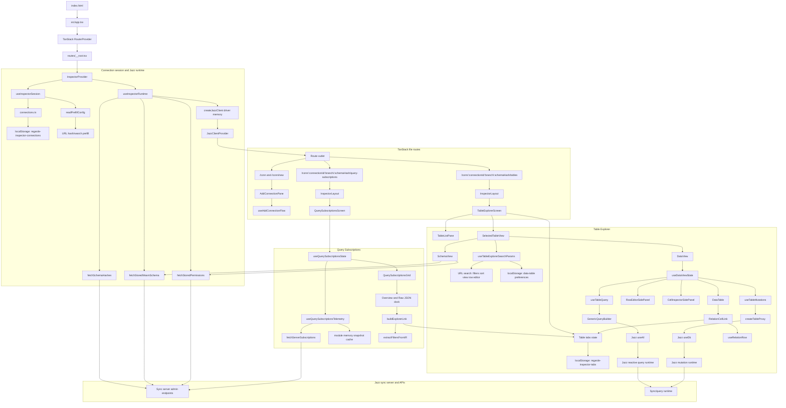

# Metadata

Author: Cleminso
Status: v1 - Working progress
Repo-URL: https://github.com/regardedev/inspector/
Doc-URL: https://github.com/regardedev/inspector/tree/main/docs/design-document.md
Audience: Project author and AI agents working on the implementation. Secondary, future contributors who want to understand
the product direction.

## Table of contents

- [Objective](#objective)
- [Background](#background)
- [Users](#users)
- [Goals](#goals)
- [Non-goals](#non-goals)
- [Architecture Diagram](#architecture-diagram)
- [Glossary](#glossary)
- [Known pain points](#known-pain-points)
- [Inspector](#inspector)
- [User interface](#user-interface)
- [Scenarios](#scenarios)
- [Product states](#product-states)
- [Out of scope features](#out-of-scope-features)
- [Performances](#performances)
- [Attack surface](#attack-surface)

## Objective

Inspector is a local, schema-driven developer tool for Jazz applications. It helps developers inspect their app data,
schema, permissions, and active sync-server query subscriptions from one interface by directly talking to the sync system.

v1 continues the MVP direction with stronger UI/UX foundations, clearer interaction design, better performance, and more maintainable architecture.

By better implementation/performance I mean faster browsing, clearer data-table interactions, stronger query subscription UX,
reusable UI foundations, and better state handling, so future inspector features can be added without becoming one-off
patches.

## Background

I'm a developer who loves Jazz-tools, a local-first relational database.

I'm using Jazz because they made my developer experience simpler to create applications with features I like such as
local-first, real-time sync. But during my developer experience there is the moment to use the inspector that I'm not
satisfied.

I found the inspector experience quality does not represent the same quality as Jazz-tools offer.

I want to build an alternative Jazz inspector that's focus on modern UX and easier to use and it's central piece for a Jazz developer that require attention and cares.

I'm making assumptions about the UX what I think is necessary for the inspector. The "UX quality" is my own judgment. My end
goal is to present this work to Jazz team and discuss to join them to work on the official inspector. I see myself working on frontend part of Jazz, such as the official inspector and Jazz dashboard.

The direction I take for this Inspector is quite different from the official one, who is more "standalone" about the framework used (pure css). Where I'm going with modern framework choice that I'm more comfortable with, and found more ergonomic. See Architecture

## Users

Primary users are Jazz app developers debugging local or development data. They understand their app schema, tables, and records, but need help seeing what the sync system stores and tracks.

## Goals

Capability tables in this document define the v1 required feature set. Items not required for v1 belong in Non-goals or Missing Features.

Make the data table the core product surface

- The data table helps developers read, filter, navigate, inspect, and edit Jazz app data.
- Redesign query subscriptions into a useful debugging surface
- Help developers understand what the sync server is tracking, which tables are involved, and how subscriptions relate back to app data.
- Establish durable UI and component foundations
- Evaluate whether lower-level base/ui primitives should replace parts of the current shadcn/ui usage when direct primitive control improves composition and maintainability.
- Improve product states across core flows. Use loading, empty, error, and success states when they help developers understand what is happening or recover from a problem.
- Raise visual and interaction quality
- Create a focused developer tool with clear hierarchy, calm surfaces with safe and precise interactions.

## Non-goals

Inspector v1:

- is not a generic database client. It is specific to Jazz concepts such as schemas, permissions, branches, sync-server query subscriptions, and admin client access.
- does not replace Jazz's in-app Inspector overlay. The standalone Inspector focuses on remote admin exploration, while the overlay focuses on an application's local identity, local store, and active development context. Their user experiences may share foundations without becoming the same product surface.
- does not generate or import app-specific query builders, table views, or custom admin screens
- remains schema-driven and generic.
- does not implement traces, logs, metrics collection, or a dedicated telemetry query endpoint. Those belong to a later telemetry-focused version.

## Architecture Diagram

## Glossary

**Inspector**

A local web React app that **connects directly to a Jazz sync server**. It loads schema metadata, creates an in-memory Jazz
admin client, and renders UI elements for developers to inspect their Jazz application, such as schema-driven tools,
filtering, mutating, and inspecting server query activity.

It is not tied to Jazz Cloud only. It is not driven by generated app-specific code.

**In-memory Jazz admin client**

A Jazz client created by the Inspector with `createJazzClient(...)`, `adminSecret`, and `driver: { type: "memory" }`.

`adminSecret` gives the Inspector admin access to inspect schema metadata and app data. The memory driver keeps the Inspector
runtime local and non-durable, so inspected data is not persisted by the Inspector client between sessions.

**Connections**:

From a user perspective, a connection is a persisted admin session configuration with app credentials. It lets the inspector
introspect a remote server and fetch schema hashes, query subscriptions, and table data. Connections are stored in local
storage under `regarde-inspector-connections`

From Jazz's perspective, a connection is a single active WebSocket transport link between client and server.

**Query subscriptions**

Server-side subscriptions that Jazz tracks for active queries. They describe which table/query/branch combinations the sync
server is currently maintaining, not a local React state or a static query result.

From the Inspector perspective, query subscription telemetry helps developers understand which app reads are active on the
server and jump from a subscription record back into the data explorer when the query can be mapped to table filters.

A Jazz query subscription is a live query registered by a Jazz client. The query is forwarded to the sync system unless
marked local-only. The server tracks it, evaluates it against schema, permissions, branches, and policy context, then sends
matching row updates back as data changes.

**Sync Server**

The Jazz server that accepts admin introspection requests, stores published schema metadata, coordinates sync, and reports server-visible query subscription snapshots.

## Known pain points

_First, the official Jazz Inspector is working, actions can be done and achieve the original purpose._

Some of my personal pain points, mostly about the UX and navigation inside the Inspector:

- navigation to switch connection
- never know which schema hash is the most recent
- lose context when browsing tables, following FK redirection
- missing dev oriented features, such as:
  - manual filter typing
  - keyboard actions
  - quick way to select and/or copy row/cell
- lack of clarity with `live-query` page
- official inspector folder is quite "messy" hard to make a contribution to

## Inspector

The web inspector is an app for Jazz developers to explore their application data. It loads published schema metadata, creates
an in-memory Jazz admin client, and renders generic schema-driven tools for reading, filtering, mutating, and inspecting
server query activity.

Because of this, the inspector can work with arbitrary app schemas without importing generated types from the target app.

The inspector is close to an **admin client talking to the sync system** rather than a purely local debug tool. It's for that the default durability/mutation tier is `edge`

To me, Jazz's in-app overlay and standalone Inspector answer different problems.

- The overlay joins the host application's local store and identity, which makes it useful for local and unsynced application state.
- THe standalone Inspector keeps an independant remote-admin workflow, switching connections, branches, and schema hashes then inspecting query subscriptions.

Standalone Inspector behavior is my product priority here.

### Composition

1. connection management
2. schema and permissions metadata loading
3. Jazz client bootstrap
4. schema-driven explorer
5. query subscriptions telemetry UI

## User interface

There is the list of screen and components that constitute the Inspector interface.

### Connection management

Connection management is the entry point for developers to inspect their Jazz app. It enables developers to create a connection to Jazz server with their app credentials, select branch and schema.

The flow must prevent silent connection failure: if the Inspector cannot validate the connection and schema are valid, it should keep the user in connection setup instead of opening a broken dashboard.

This flow **must answer**:

- do I have any saved connections?
- which Jazz app am I about to inspect? which branch and schema version is it?
- are my credentials valid for this appId?
- if connection to server fails, what failed, and what do I need to fix?
  - is the server URL reachable?
  - does the `appId` match the credentials?
  - are there published schema hashes?

#### Non-goal

- Connection management is not account management.
- It does not manage Jazz Cloud projects.
- It does not discover apps automatically.
- It stores local developer credentials only.
- It does not persist schema payloads, only connection configuration.

#### User background when arriving here

1. First-time user
   - has a Jazz app
   - wants to establish a connection via the Inspector for the first time
   - has copied credentials manually or opened a local-dev prefill link
   - needs confidence that the connection points to the intended app
   - needs to understand which schemaHash is latest
   - may need to inspect older schema
2. Returning user
   - has saved connections
   - expects saved connections to reopen quickly
   - needs to know whether the saved connection is still valid
   - needs to know whether Inspector opened the latest schema or a previous one
   - may create a new connection and need to perform it quickly
   - may be surprised that a saved local connection still needs the local runtime/server running
3. Debugging wrong app
   - sees unexpected rows, missing tables, or no query subscriptions
   - needs to verify `serverUrl`, `appId`, `branch` and `schemaHash`
   - needs confidence that Inspector is attached to the same app/runtime they are debugging

#### How it works

From a user perspective, a connection is a persisted admin session configuration with app credentials. It lets the inspector
introspect a remote server and fetch schema hashes, query subscriptions, and table data. Connections are stored in local
storage under `regarde-inspector-connections`.

From Jazz's perspective, a connection is a single active WebSocket transport link between client and server.

#### v1 required capabilities

| Capability                | Notes                                            |
| ------------------------- | ------------------------------------------------ |
| Add connection            |                                                  |
| Edit connection           | Revalidate and reopen on the latest schema hash  |
| Browse active connections |                                                  |
| Connection switching      |                                                  |
| Delete connection         |                                                  |
| Local-dev prefill         | Open inspector directly from app dev server only |

Must support:

- [x] add connection
- [ ] edit connection
- [ ] delete connection
- [x] switch active connection
- [x] switch schema hash within the active connection
- [ ] keep prefill local-dev only

#### First-run flow

1. User fills `AddConnectionForm` with connection credentials
2. It calls `useAddConnectionFlow` with `fetchSchemaHashes` to verify app credentials match
3. Once validated, user chooses one published schema hash
4. `app` persists the resolved connections

#### Connection switching

Once connected the users must be able to switch to another connection from anywhere in the inspector dashboard instead of going back to the home page.

#### Editing a connection

Editing a connection must revalidate the updated credentials. After a successful edit, the inspector redirects to the latest generated schema hash instead of asking the user to select a schema again.

The schema switcher shows which schema hash is latest.

If validation fails, render the validation error and keep the edit form open. If the server returns no schema hashes, use the same error handling as the add-connection flow. Branch handling should follow the current connection/session behavior.

#### Prefill connection

_Prefill connection is supported for local development, but is not required for production because it depends on wrapping Jazz dev internals._

When user run his Jazz app, with `buildJazzInspectorLink` from `packages/jazz-dev-tools/src/dev/jazzInspectorLink.ts` print a
direct inspector connection link to open in a browser.

#### Saved connection availability

Saved connections persist credentials and preferences in local storage. They do not persist the stored schema payload or the
server's schema hash list.

Opening a saved connection still needs the Jazz server at `serverUrl` to be reachable when Inspector resolves schema hashes,
fetches the selected stored schema, creates the admin client, and loads query subscription telemetry.

If the app dev server only produced the inspector link but the Jazz server is remote and still reachable, the saved connection
can open without the app dev server. If the app dev server owns the managed local Jazz runtime, stopping it makes the saved
connection unavailable until the runtime is running again.

When resolving `/conn/:connectionId` or `/conn/:connectionId/:branch`, Inspector fetches schema hashes. If that request fails,
resolution returns no target and redirects to the connection screen. When opening a full route that already includes a schema
hash, runtime bootstrap can still fail if the server cannot return the schema or create the admin client.

UI representation:

- Surface: connection list, add/edit connection form, schema switcher in the app shell.
- Primary controls: add connection, edit connection, delete connection, switch connection, switch schema hash.
- Primary content: connection name, server URL, app id, branch, active schema hash, latest schema hash.
- States: first run, validating credentials, invalid connection, no schemas, stale schema hash, connection deleted.

### Runtime bootstrap

#### Purpose

Runtime bootstrap turns a selected connection, branch, and schema hash into the active Inspector runtime. All data surfaces depend on this runtime.

#### Sequence

1. User selects or opens a connection route.
2. Inspector resolves `connection`, `branch`, and `schemaHash`.
3. `useInspectorRuntime(...)` creates an in-memory Jazz admin client with `createJazzClient(...)`.
4. Inspector fetches stored schema, available schema hashes, and stored permissions.
5. The app shell renders the data surfaces once the client and schema are ready.

#### Failure model

- Missing connection, branch, or schema hash clears the runtime.
- Client creation failure is fatal for the active session.
- Stored schema fetch failure is fatal for the active session.
- Schema hash fetch failure blocks schema-switching context.
- Permissions fetch failure is non-fatal; the UI can continue without permission hints.
- When the user changes connection, branch, or schema hash, stale async work is ignored and the previous client is shut down.

#### Why memory driver

The Inspector creates a local admin client with `driver: { type: "memory" }` because it needs live Jazz runtime behavior without persisting inspected app data in the Inspector client.

### Table explorer

The Table Explorer is the main interface for inspecting Jazz app data. It turns stored schema metadata into a table UI where developers can read rows, filter data, follow references between tables, perform mutation operations.

This flow **must answer**:

- Which table am I inspecting?
- Which rows match the current filters and sort?
- Is the table empty, or did my filters hide the rows?
- What is the full value behind a truncated cell?
- Which fields are relations, and where do they point?
- Which row is selected?
- What changed while I was looking at this table?
- Can I safely edit this row, and what happened if the mutation failed?
- Am I seeing a stable page of data or a live update?

#### User background when arriving here

1. Debugging app data
   - wants to know whether expected rows exist
   - wants to inspect exact stored values
   - wants to verify app UI actions are recorded
2. Following column relationships
   - starts from one row
   - needs to follow relation ids or foreign-key into related tables
   - needs to keep context instead of losing original table
3. Testing setup
   - wants to insert or edit rows for local/dev testing
   - needs mutation errors to be clear and recoverable
4. Large-table browsing
   - needs predictable and controllable table loading
   - needs filters, pagination, and stable selection
   - should not lose context because live data changes

#### v1 required capabilities

| Capability              | Notes                                                                          |
| ----------------------- | ------------------------------------------------------------------------------ |
| Read rows clearly       | Cell rendering based on column type, column labels, truncation, copy behavior  |
| Browse large tables     | Page-windowed loading with row-count controls                                  |
| Filter rows             | Existing generic filter builder, validation, visible active filters            |
| Select and inspect rows | Side panel, select state, row details                                          |
| Foreign-key relation    | Relation cells between tables, missing relation handling, table tabs           |
| Expose schema context   | Column types, references, nullable/required state, permissions display         |
| Edit existing rows      | Side-panel edits with validation and unsupported type handling                 |
| Insert rows             | Required fields, defaults, validation, permission hints                        |
| Delete rows             | Destructive confirmation with immediate undo through restore                   |
| Show live row updates   | Highlight changed cells and rows without forcing a manual refresh              |
| Row bookmarks           | Breakpoint-like row markers that help developers keep focus inside large pages |

#### Table list

The table list is the entry point into the Data Explorer. It helps developers find the table they want to inspect and
keep the current table context visible.

It answers:

- What tables exist in the selected schema?
- Which table is currently selected?
- Which tables match the current search?
- Is the table list empty because the schema has no tables, or because the search hides them?

v1 keeps this surface simple. The table list is navigation, not a full schema browser. Deeper schema details can live
near the selected table or in the Schema Inspector.

When the inspector opens for the first time, the Data Explorer auto-selects the first available table and opens it as the first table tab.

If no table tab is open, the main table surface renders an empty state instead of the data-table toolbar. That empty state shows recently opened tables so the developer can reopen prior work quickly.

**Table action item**

A table action item can be checked when hovere via a checkbox component that replace the leading table icon. Click right open a menu of actions (open x tabs; close x close; pin x tables; deselect all)

Selection rules

- Normal click:
  - Toggle only the clicked item
  - Replace the anchor with that item
- Shift-click with a valid visible anchor:
  - Find anchor and target indices in filteredTables
  - Take the inclusive range
  - Apply the target checkbox’s new state to the complete range
  - Preserve the original anchor so another Shift-click can extend the range
- Shift-click without a visible anchor:
  - Treat it as a normal click and establish a new anchor
- Shift-unchecking:
  - Uncheck the inclusive range
- Search filtering:
  - Operate only on visible items. Hidden tables should not change unexpectedly

A ref is suitable for the anchor because changing it does not affect rendering. Checked names remain React state because they affect the UI and bulk commands.

Accessibility

- Shift+Space on a focused checkbox should use the same range logic
- Per-item :focus-within should reveal the checkbox just like hover
- Checkbox and navigation trigger remain siblings
- The checkbox receives the click without activating the table link

#### Table tabs and saved table state

Table tabs follow this model:

- the first tab for a table uses a deterministic tab id based on the table id
- the same table can be opened in several tab views with different filters or sort state
- additional tab views use a unique tab id and keep their own table view state
- opening a table from the table list focuses the existing base table tab when it exists, otherwise creates it
- clicking a relation opens the matching referenced table tab view if it exists, otherwise creates a filtered tab view
- the active table is URL-backed
- open tabs are persisted in localStorage under `regarde-inspector-tabs`
- recently opened tabs show the last five opened tables when no tab is open
- filters and sort are per tab view
- filters and sort are URL-backed for the active tab view and also saved in storage
- data-table column state is saved per table
- page index is memory-only and resets when table, filters, or sort changes

<!--- TODO: Review this decision, I'm not sure finally: v1 supports multiple tab views for the same table when the views have different filters or sort state-->

- if a saved or URL-backed tab references a table missing from the selected schema, Inspector renders an unavailable-table empty state, does not run table queries, and lets the user close the tab or switch schema hash

State split:

- URL: active tab view, active table, shareable filters, shareable sort
- localStorage: open tab list, recent table list, saved tab view state, saved data-table preferences
- memory: pagination, transient selection, live update highlights, row editor focus

Do not add sessionStorage unless a specific table state needs to survive route navigation without surviving a browser restart.

Tab context menu:

- close
- close other
- close to right
- close all

UI representation:

- Surface: left table sidebar inside the Data Explorer.
- Primary controls: table search and table selection.
- Primary content: schema table names, open table tabs, active table state, recently opened tables when no tab is open.
- States: loading schema, no tables, search-empty, active table unavailable, no open table tab.

#### Data table

Detailed row selection, cell selection, side-pane, column-selection, and bulk-edit behavior lives in the focused
[Table Explorer selection and pane behavior specification](./tableExplorerBehaviors.md). This document retains the product and
architecture summary; the focused specification owns interaction scenarios and unresolved behavior decisions.

The data table is the core product surface of the Data Explorer. It is read-first and record-oriented. `DataTable` is the
consistent name for the reusable design-system renderer and table surface. `DataGrid` names the spreadsheet behavior layer for
opening complete multi-cell selections, column operations, matrix copy and paste, bulk cell editing, and complete keyboard cell
navigation.

Most Data Explorer actions converge in the data table. It brings row reading, filtering, selection, relation navigation,
schema context, and safe edits into one coherent surface.

The data table does not become table-specific UI. Special behavior comes from schema metadata or generic Inspector rules.

`@inspector/ds` owns the reusable `DataTable` presentation system. `apps/web` owns the Inspector composition, TanStack table
construction, Jazz queries, schema-derived columns, filters, relations, routes, and mutations. The design-system root receives
a controlled TanStack `Table<TData>` instance rather than receiving duplicate data, columns, sorting, pagination, or selection
state.

The design-system API uses compound parts so consumers can compose the required structure without styling escape hatches:

- `DataTable.Root`
- `DataTable.Viewport`
- `DataTable.Header`
- `DataTable.HeaderRow`
- `DataTable.HeaderCell`
- `DataTable.Body`
- `DataTable.Row`
- `DataTable.Cell`
- `DataTable.Empty`
- `DataTable.Loading`
- `DataTable.Footer`

These parts own semantic table markup, StyleX styles, focus presentation, state attributes, and constrained variants. Consumers
provide application content and state but do not receive `className`, inline `style`, raw CSS values, or broad styling slot
overrides. A standard renderer can iterate TanStack header groups, rows, and visible cells, while manual compound composition
supports advanced consumers such as expanded Query Subscription rows.

The replacement starts from a fresh design-system table surface rather than wrapping or restyling the deprecated renderer. The
rewrite preserves application logic that already has the correct ownership: stored-schema interpretation, generic Jazz query
construction, URL state, table preferences, relation navigation, and mutation parsing. Deprecated rendering components and
layout CSS are removed only when the new table can render a complete read-only slice.

v1 uses page-windowed table browsing. Virtualization can still render the current page efficiently, but the product model is pagination.

Interaction state keeps these concepts separate:

- the active column is the transient column inspection target
- the focused cell is the row and column intersection receiving the strongest cell focus treatment
- selected cells are an explicit cell operation set that can span rows and columns
- selected rows are the checkbox-controlled, page-local bulk operation set
- the focused row is the selected row represented by the row side pane
- bookmarked rows are persistent developer reference points

Selection and side-pane presentation are independent. A cell can be focused without opening the pane, and a multi-cell selection
can be assembled before the user chooses `Open selection`. The side pane uses an explicit presentation model:

- `closed`: no side pane
- `insert`: the schema-driven insert form
- `rows`: checked row ids and one focused row rendered by the complete-row editor
- `cells`: one or more row-id and column-id targets rendered by schema-aware cell components grouped by column

Single-clicking a cell focuses it without opening or changing the pane. Double-clicking opens that cell in the cell pane;
double-clicking the same cell again closes the pane and clears that cell's selection and focus.
Command/Control-click builds an additive multi-cell selection across rows and columns, while Shift-click selects the rectangular
range between the anchor and target. A context-menu `Open selection` action
opens that selection in column-grouped pane sections. Cell components dispatch from schema metadata: structured values can use formatted code or tree views,
relations can show their target, dates can show formatted and raw values, binary values can show metadata and download actions,
and scalar values can expose their exact value and type.

The foundation reuses the existing schema-derived field rendering and type components in an inspection-only cell pane. Redesigning
individual cell-type presentations and adding cell mutation, review, confirmation, or save behavior are outside that foundation.

Clicking checkboxes individually builds the checked-row set. Shift-clicking another checkbox selects the visible range from the
checkbox anchor. The checkbox opens the complete-row editor for the checked-row set. Previous and next controls navigate checked
rows in active query order, while edit actions remain scoped to the focused row unless explicitly labelled as bulk actions.
Insert remains a separate pane mode. Unless an open nested control consumes Escape first, Escape closes an open pane while
preserving its table selection. With no pane open, Escape clears cell selection, cell focus, and column focus without unchecking
rows.

Closing a pane preserves its table selection. Filter, sort, page, table, or schema changes clear row and cell selections. Column
reorder preserves selected cells, hiding a selected column removes its cells, and loading more rows does not extend an existing
selection.

Focusing a cell in the focused checked row keeps the row pane open and focuses that field's first available control. Cells in
other rows do not silently retarget the row editor. Double-clicking a cell or explicitly opening a cell selection changes the pane
presentation. Numeric row and column coordinates can support developer orientation, but row IDs and column IDs remain the
selection identity.

A focused cell receives the selected-cell background and blue focus border without changing its whole row background. A checked
row uses the selected-row background without an additional row border. The focused checked row adds a distinct blue focus edge.
The complete checkbox cell is the checkbox hit area: pressing empty space inside it toggles selection and opens the complete-row
editor rather than focusing a data cell.

Clicking a column header clears cell focus and selection, closes an open cell pane, then activates and highlights that column and
its visible cells. Clicking the active header again, pressing Escape, clicking a cell, or pressing elsewhere in the interface
clears the active column. Focus remains visible independently of color. Active column, active cell, checkbox selection, dirty
state, validation state, and live-update highlights use distinct semantic states so one highlight does not imply several
meanings.

Editing happens in the side pane, not inline in the v1 data table.

Columns use schema-aware initial widths rather than one width for every value. Boolean and numeric columns start narrow; ids,
relations, timestamps, text, and structured values receive progressively wider defaults. Header resize handles update TanStack
column-sizing state within constrained minimum and maximum widths. A double-click on the handle resets the schema-derived
width. Column sizing preferences are scoped to the active connection, branch, schema hash, and table.

Data columns can be reordered by dragging their header horizontally. A short movement threshold preserves normal header clicks,
and interactive header controls such as checkboxes, resize handles, and menu actions do not start dragging. Column order is
controlled by the Inspector, persisted with the other table preferences, and normalized when schema columns are added or
removed. During dragging, the header and every visible body cell use the same preview order so the complete column moves as one
unit. The checkbox column remains fixed at the leading edge and is not part of the draggable order.

Cell context menu:

- copy cell value
- copy row
- filter by value
- edit row
- open selected cells

`Filter by value` completes the FilterBar with the clicked cell value. The default operator is `eq`, and the user can still change the operator before or after applying the filter.

Column selection is an explicit header context-menu action rather than a normal header click. `Open column selection` must state
whether it targets visible cells or every row matching the active query. Visible cells form a table selection; every matching row
is a separate query-backed bulk operation.

Column-header, row, and cell context menus use the design-system `ContextMenu` component. `DataTable` identifies the interaction
target; `apps/web` derives available actions from the Jazz schema, row state, and navigation context.

UI representation:

- Surface: main center table surface.
- Primary controls: filters, pagination, row-size selector, refresh, insert row.
- Primary content: rows, columns, active row/column/cell state, relation cells, checkbox selection, live update highlights, row bookmarks.
- States: loading, no open table tab, empty table, filtered-empty table, unsupported field display, changed cells, inserted row, deleted row animation, stale live data.

#### Column type rendering

Column headers render compact type markers from Jazz schema metadata. The marker should describe the Jazz DSL type first; semantic formatting such as email, URL, image, or currency can be layered on later only when the schema exposes enough metadata to identify it safely.

The type marker composes a base type, container, and modifiers rather than treating every combination as an independent visual
type. Optionality changes null handling around the base renderer. A transform does not receive its own value renderer; the
effective value uses the appropriate base renderer, while schema details disclose the transform when it affects filtering,
editing, copying, or round-trip safety.

Header markers compose these dimensions directly, including forms such as `T?`, `REF?`, `REF[]`, `{T}`, and `T FX`. The compact
symbol remains secondary to the column name and exposes an accessible Jazz type label.

| Symbol | Jazz DSL type              | TypeScript value      | SQL storage         | Notes                                                                 |
| ------ | -------------------------- | --------------------- | ------------------- | --------------------------------------------------------------------- |
| `T`    | `s.string()`               | `string`              | `TEXT`              | Plain text. Do not infer semantic text types from the SQL type alone. |
| `?`    | `.optional()`              | base type or `null`   | nullable column     | Modifier badge, not a standalone type.                                |
| `#`    | `s.int()`                  | `number`              | `INTEGER`           | Whole numbers.                                                        |
| `F`    | `s.float()`                | `number`              | `REAL`              | Floating-point numbers.                                               |
| `B`    | `s.boolean()`              | `boolean`             | `BOOLEAN`           | True/false values.                                                    |
| `TS`   | `s.timestamp()`            | `Date`                | `TIMESTAMP`         | Render relative and absolute time where useful.                       |
| `BIN`  | `s.bytes()`                | `Uint8Array`          | `BYTEA`             | Binary data. Prefer Files & Blobs patterns for uploads and images.    |
| `ID`   | `s.ref("table")`           | row ID `string`       | `UUID` foreign key  | Relation to another table. Ref columns must end in `Id` or `_id`.     |
| `[]`   | `s.array(type)`            | array of base type    | base SQL array      | Render as an array container with the nested type marker when known.  |
| `IDS`  | `s.array(s.ref())`         | row ID `string[]`     | `UUID[]`            | Relation list. Ref array columns must end in `Ids` or `_ids`.         |
| `E`    | `s.enum("a", "b")`         | string literal union  | `ENUM(...)`         | Show allowed values in details, not the compact header.               |
| `{}`   | `s.json()`                 | `JsonValue`           | `JSON`              | Untyped JSON; replace whole value on write.                           |
| `{T}`  | `s.json(schema)`           | schema-inferred value | `JSON`              | Typed JSON; still atomic on write.                                    |
| `FX`   | `.transform({ from, to })` | transformed value     | underlying SQL type | Modifier badge. Filters use the stored column value.                  |

#### Row reading and cell rendering

Rows are readable before they are editable.

Cells render values based on type and context:

- short primitive values can render inline
- long strings are truncated with a way to inspect/copy the full value
- JSON-like values are readable and copyable
  - data table shows truncated preview
  - side panel shows editable textarea when safely serializable
- binary values are not editable text
- relation values use relation cell rendering when schema metadata provides a reference
- relation values use `TextLink` with a trailing arrow; text uses the normal foreground color and changes to link color on
  hover or keyboard focus without adding an underline
- timestamps are formatted for reading while preserving the raw value when copied

The goal is not to make every cell interactive. The goal is to make every cell understandable.

Grid cells use bounded, schema-derived previews. The grid does not serialize complete structured or binary values into a cell,
and it does not replace stored identifiers with inferred semantic labels. The side pane is the authoritative surface for the
complete value, alternate representations, copying, validation, and editing. Cells do not open hover cards; click, double-click,
context-menu, and relation navigation already provide the grid's interaction layers.

| Condition | Grid representation | Side-pane representation |
| --------- | ------------------- | ------------------------ |
| Row ID | Full ID at the schema-derived initial width. Middle-truncate only when the user narrows the column. | Read-only input group with the complete ID and Copy action. |
| Non-empty string | Text with end truncation when it exceeds the available width. | Auto-growing text control with native text selection and clipboard behavior. |
| Empty string | Explicit `""` so it cannot be mistaken for `NULL`. | Empty editable text control. |
| Integer | Right-aligned whole number. | Numeric text input with integer parsing and validation. |
| Float | Right-aligned readable number; preserve full precision outside the compact preview. | Numeric text input that preserves intermediate editing states and validates finite values. |
| Boolean | Non-interactive boolean indicator with `true` or `false` text. | `ToggleGroup` with `True` and `False`; add `Null` when optional. |
| Valid timestamp | Absolute date and time in the browser timezone without fractional seconds. | Date-time field plus browser-local, UTC, relative, and raw epoch representations. |
| Malformed timestamp | Explicit invalid-value treatment with the raw value preserved. | Raw value, validation message, and no misleading date formatting. |
| Non-empty bytes | Byte count only, such as `317 B` or `2 KB`. | Read-only input group with byte count and a `Copy as` menu for Hex, Base64, and Download raw. |
| Empty bytes | `0 B`. | Read-only input group with `0 B`; binary actions remain available when meaningful. |
| Resolved reference | Stored relation ID as a `TextLink` with a trailing arrow. | Editable raw relation ID when writable, target table, resolved display value, Copy ID, and Open target. |
| Missing reference target | Stored relation ID with a missing-target state; never replace it with an empty label. | Editable raw relation ID when writable, target table, missing-target message, and Copy ID. |
| Scalar enum | Plain enum value. | `Select` constrained to schema values. |
| Malformed enum | Raw value with an invalid-value treatment. | Current raw value, schema options, and validation message without silent replacement. |
| Empty array | `[]`. | Empty structured array editor in `Details`; read-only expandable array in row `JSON`. |
| Primitive array | Item count and bounded one-line preview, such as `[3] reader, writer, reader`. | Schema-derived repeatable fields when practical, with JSON text editing as the generic `Details` fallback. |
| Enum array | Item count and bounded enum preview. | Repeatable `Select` rows that preserve order and duplicate values. |
| Reference array | Item count and bounded raw-ID preview. | Repeatable relation fields with raw IDs and explicit navigation actions. |
| Empty JSON object | `{}`. | JSON text field in `Details`; read-only expandable object in row `JSON`. |
| Untyped JSON | Key or value count plus bounded one-line preview. | JSON text field with parsing feedback in `Details`; read-only expandable object or array in row `JSON`. |
| Typed JSON | JSON summary with the `{T}` marker and bounded one-line preview. | JSON text field with schema-derived validation in `Details`; read-only expandable object or array in row `JSON`. |
| `NULL` | Explicit subdued `NULL` marker. | `NULL` control layered around the base editor. |
| Unavailable value | Explicit unavailable marker rather than an empty cell. | Unavailable explanation and disabled field actions. |
| Unsupported or malformed value | Raw bounded preview with an invalid or unsupported state. | Raw value, schema expectation, and reason the value cannot be represented or edited safely. |

Timestamp display uses the user's browser timezone, available through the browser's internationalization APIs. The sync server's
deployment location does not determine display timezone and cannot be inferred reliably from a timestamp or server URL. UTC and
the raw epoch remain available in the side pane. Relative time is supporting information rather than the primary grid value.

Reference details in the side pane show the target table, the complete stored relation ID, a resolved display value when one is
available, and whether the target row was found. Clicking the relation keeps the existing navigation behavior. Showing the stored
ID as the primary grid value preserves database truth, exposes broken references, and avoids making asynchronous target-row
resolution look like the stored value. Writable reference fields accept direct row-ID input and may add generic target lookup;
synthetic row IDs remain read-only.

Jazz byte values are `Uint8Array` values stored as SQL `BYTEA`. Because a byte sequence has no canonical clipboard text form,
binary copy commands name the encoding explicitly. Hex supports byte-level debugging and Base64 supports transport through APIs
and text formats. PostgreSQL literals and JavaScript indexed-object serialization are not primary Inspector representations.

Reusable, type-specific presentation and editor components belong in `packages/design-system`. The components remain independent
from Jazz schema objects: they receive constrained display values, metadata, states, and callbacks. `apps/web` owns the mapping
from Jazz schema metadata to those components, relation resolution and navigation, parsing, validation, and mutation behavior.
Dedicated design-system components are required for binary preview and inspection, timestamp presentation and date-time editing,
structured-value preview and JSON viewing, and relation presentation and field actions. Primitive text, numeric, boolean, enum,
copy, and null controls should compose existing design-system components unless a repeated semantic contract justifies a dedicated
component.

The row side pane has two representations:

- `Details` is the schema-derived insert and edit form. Field labels show Jazz semantics such as `string`, `timestamp`, `bytes`,
  `ref → rooms`, and `json<typed>` rather than SQL storage labels.
- `JSON` is a read-only, syntax-colored structured tree inspired by Geist JSON View. It expands top-level fields initially,
  supports branch disclosure, keyboard tree navigation, search highlighting, selectable text, and whole-row Copy JSON. The row
  JSON representation is not an editing surface; all row mutations remain in `Details`.

The structured tree is an independent design-system component. It owns bounded tree presentation, expansion, keyboard behavior,
focus, accessible tree semantics, and highlighting. `apps/web` normalizes Jazz values, owns the copy representation, and supplies
explicit representations for timestamps, bytes, references, unsupported values, and exhausted rendering budgets. Binary values
must not become indexed-object `Uint8Array` serialization in the JSON representation.

Editable controls keep normal form semantics: one click focuses and positions the caret, and double-click remains normal text
selection rather than entering edit mode. Read-only identifiers can expose a Copy suffix, and binary fields expose `Copy as`.
When an editable field is nullable and suffix space is constrained, the `NULL` control takes precedence over Copy; users can copy
editable text through normal selection and platform clipboard commands.

#### Browsing large tables

The MVP uses incremental loading. v1 replaces this with page-windowed browsing.

The browsing model prioritizes:

- stable page boundaries
- fast first useful render
- predictable loading boundaries
- clear difference between loading, empty, and filtered-empty states
- no avoidable reloading when selection, filters, or column visibility changes

Inspector uses Jazz `limit` and `offset` directly:

- `limit(pageSize + 1)` detects whether another page exists
- `offset(pageIndex * pageSize)` selects the current page window
- sorting must be deterministic before pagination so the same query returns a stable row order before applying `limit` and `offset`
- the UI does not show exact total records unless Jazz exposes a reliable count

Controls:

- previous page
- next page
- page number input
- rows per page

Defaults:

- default page size: 100 rows
- page size options: 100, 500, 1000
- default sort: deterministic latest-first row order when Jazz can express it, otherwise stable `id` order
- page index: memory-only
- page size: saved as a data-table preference

The page number input can jump to a known page by mapping `pageIndex` to `offset`. If the requested page has no rows, Inspector falls back to the nearest page with rows.

Avoid exact `Page X of Y` and exact record counts for v1 unless Jazz exposes a reliable count.

Side-panel row focus is row-id based and can survive page changes. Checkbox selection is page-local and can clear when page, filters, or sort changes.

#### Selection and row inspection

Clicking a row checkbox opens a side pane that gives the developer a focused place for reading and editing checked rows. Clicking
additional checkboxes extends that row set, while one checked row remains focused and is represented as a position such as
`2 / 4`. Single-clicking a data cell focuses it without opening the pane. Double-clicking a cell opens its schema-derived cell
presentation. Explicit context actions open multi-cell selections. The focused behavior specification defines the detailed
transitions and visual precedence.

The side panel answers:

- Which row am I editing?
- What are the full field values?
- What fields changed?
- What validation errors exist?
- What happened after save/delete?
- Which values are read-only?

The active row remains stable when possible. Filtering, sorting, or refreshing data does not make the user lose context
without a clear reason.

Opening the cell pane preserves the focused cell. Opening the row pane renders all schema fields, including fields hidden from the
table, and focuses the active row rather than treating every checked row as one implicit bulk mutation.

UI representation:

- Surface: right side panel attached to the active table view.
- Primary controls: close panel, save changes, reset changes, delete row, copy row, open relation target.
- Primary content: active row id, field list, full values, relation targets, schema hints, staged changes, validation and mutation errors.
- States: no active row, active row loading, clean row, dirty row, saving, saved, mutation rejected, row missing after refresh, unsupported read-only field.

#### Schema context inside the explorer

The Data Explorer exposes enough schema context to explain what the user is looking at without forcing them to open raw
schema JSON.

Useful context includes:

- column type
- reference target
- nullable or required state when available
- permission hints when useful
- primary identifier fields

This context supports the current task. It does not overload the data table with schema details that belong in the Schema
Inspector.

#### Filter builder

It gives developers control on what specific data they want to render from a given table. It helps for debugging and searching.

It validates and parses input before clauses are applied.

Since the target audience is developers, I opt for a component that handles both click selection and manual typing.

v1 keeps the existing generic filter query semantics and exposes two synchronized interfaces over one controlled filter model:

- `DataTableFilterBuilder` sits below the table tabs and provides a command-style, keyboard-friendly experience
- `DataTableFilterControl` sits in the left pane and provides direct field and operator controls

Both interfaces read and update the same URL-backed applied clauses. Adding, editing, or removing a clause in either interface
updates the other. Closing the left pane does not limit filtering because the builder remains available.

The filter interface is a FilterBar: one search-like input that supports both typing and selection. The user can type a column name, pick suggestions, choose an operator, enter a value, and see the applied filter rendered as a compact editable token.

The filter bar feels like a command input, not a form builder hidden behind a modal.

Supported operators:

- `eq` | `ne` | `gt` | `gte` | `lt` | `lte` | `contains` | `in` | `isNull`

Operators are schema-gated by column type. Filter clauses combine as a flat `AND`. Each clause becomes a generic Jazz `.where(...)` condition; `eq` uses shorthand equality and other operators use explicit operator records.

Filters are serialized as URL-backed tokens: `{ id, column, operator, value }`. Advanced query shapes remain out of scope. Query Subscription links into the Data Explorer only map filters Inspector can translate safely.

Applied clauses and in-progress input are separate states. Applied clauses are URL-backed. The current column, operator, raw
value, completion stage, and validation issue are transient memory state. Cell context actions and Query Subscription links use
the same schema-validation and filter actions as both visible filter interfaces.

Jazz does not expose generic count, distinct, group-by, aggregate min/max, or facet-count queries. Filter controls may use safe
schema metadata such as enum variants, booleans, nullability, references, and stored types, but they do not present current-page
counts as table-wide facets.

UI representation:

- Surface: builder below the table tabs and direct controls in the left pane.
- Primary controls: type filter, choose column suggestion, choose operator, enter value, remove token, add more filters.
- Primary content: compact filter tokens and a trailing `Add more filters...` input.
- States: invalid value, unsupported operator for type, no filters, unsupported query mapping.

#### Relation navigation

If a column has `references` and the current cell contains a relation id, the inspector renders a relation cell instead of
plain text.

That relation cell:

1. queries the referenced table for the related row
2. tries to choose a friendly display column like `name` or `title`
3. links into the related table using an `id = ...` filter

This gives the explorer graph-style navigation without a separate relation viewer.

v1 relation behavior:

- show the raw relation id immediately
- resolve a friendly label progressively when affordable
- cache relation labels by connection, branch, schema hash, table, and id
- label loading never blocks the data table; raw ids are always valid fallback UI
- clicking a relation opens a new table tab for the referenced table
- the new tab applies an `id = relationId` filter
- missing, deleted, or inaccessible related rows degrade to raw id and a clear empty state

UI representation:

- Surface: relation cells inside the data table and row side panel.
- Primary controls: open related table tab, copy relation id.
- Primary content: raw id, friendly label when resolved, target table name.
- States: loading label, missing or inaccessible target, unsupported reference metadata.

#### Mutation/insert

As a developer I want to write inside tables for debugging and test setup.

v1 uses side-panel editing only.

- row checkbox selection opens the complete-row side panel
- cell double-click opens the schema-derived cell side panel
- selected-cell context actions can open an explicit multi-column cell selection grouped by column
- edits are staged before save
- insert uses the same side-panel form pattern
- unsupported field types are visible but read-only
- inline cell editing is out of scope for v1

Side-pane editing is the default and only v1 editing presentation. An optional inline presentation remains outside v1 for users
who prefer direct cell editing. Both presentations must use the same row draft, schema parsing, dirty-field,
validation, conflict, and mutation controller rather than implementing separate write paths. Adding inline presentation does
not change the read-first default or cause cell activation to write immediately.

The shared row draft tracks the baseline row, baseline update metadata, raw input, parsed values, dirty fields, validation
issues, unsupported fields, mutation status, and remote-change status. Saves send a partial patch for dirty fields rather than
resubmitting every editable field.

Permissions are shown as debugging hints, not guarantees. The server/runtime response is authoritative.

Inspector follows Jazz runtime behavior. The form is generated from stored schema metadata and writes through the generic Jazz runtime: `db.insert(...)`, `db.update(...)`, `db.delete(...)`, and `db.restore(...)` for immediate undo when available.

Inspector does not disable admin insert, update, or delete only from stored permissions. If a mutation fails, keep the form open, preserve input, show the rejection, and let live data reconcile.

Values are parsed conservatively from schema metadata. Primitive values, enums, JSON-like values, arrays, and relation ids can be edited when Inspector can serialize them safely. Values Inspector cannot serialize safely remain visible and read-only.

UI representation:

- Surface: right row side panel.
- Primary controls: save, reset, delete, undo delete, copy values.
- Primary content: fields, schema hints, staged changes, validation errors.
- States: clean, dirty, saving, saved, rejected, unsupported field, permission hint.

#### Delete rows

Delete is useful and treated as a careful editing experience.

Deletion needs:

- clear destructive confirmation
- visible row identity before confirmation
- permission awareness
- immediate undo after delete when possible
- recovery behavior when the server rejects the mutation
- careful copy so the user knows what will happen

Undo can call `db.restore(...)` for the deleted row. Full deleted-row browsing with `includeDeleted()` is out of scope for v1.

#### Unsupported table actions

v1 does not expose `upsert`, `transaction`, or `batch` flows. They depend on app-specific intent and are not simple row actions.

Inspector also does not aim to support every Jazz query shape in the Table Explorer. v1 focuses on flat table queries: filters, sorting, limit, and offset.

#### Explicit live-update UX

Jazz data can change while the developer is inspecting a table, either through new rows, updated rows, deletes, or side-panel saves.

v1 makes live updates visible without forcing the user to refresh and lose context.

Behavior:

- highlight changed cells when a visible row value changes
- highlight inserted rows when they enter the current page
- animate deleted rows when the user deletes from the inspector
- preserve the selected row and side panel when possible
- avoid jumping scroll position or replacing the visible context unexpectedly
- use the same changed-cell highlight after a successful side-panel save

Highlights are ephemeral and brief.

Advanced live-update controls such as pause, replay, update history, or subscription-level pause/resume are out of scope for v1. Jazz `useAll(...)` keeps a live subscription active while mounted. Inspector can unsubscribe by skipping a query, but freezing visible rows would require an inspector-owned snapshot and stale-data model. v1 makes live changes visible and preserves user context instead.

An out-of-scope `Live`/`Paused` presentation can freeze an Inspector-owned visible snapshot while Jazz remains connected and the table
subscription continues receiving changes. The paused state can report pending inserted, updated, and deleted rows, then
reconcile and highlight changes when returning to `Live`. Jazz `Db.disconnect()` and `Db.reconnect()` are not used for this
feature because they control remote synchronization for the whole database connection rather than one visible table, do not
freeze local subscription updates, and can leave edge-durability mutations pending.

#### Row bookmarks

Large table pages need a way to keep visual focus while comparing distant rows.

v1 supports row bookmarks, similar to editor debugging breakpoints. A developer can mark rows from the checkbox column by using a small dot affordance in the checkbox cell.

Bookmarks render as horizontal row markers. They do not draw a vertical rail between two bookmarked rows.

Rules:

- bookmarks are UI-only and do not write to Jazz
- bookmarks are scoped to connection, branch, schema hash, and table
- bookmarks attach to row ids, not visible indexes
- if filters hide a bookmarked row, it remains in the table bookmark list but is not drawn in the visible data table
- the active table exposes a bookmark list for that table
- the bookmark list can jump to, rename, and delete bookmarks
- clicking the bookmark dot on a bookmarked row removes the bookmark
- clicking a visible bookmark scrolls to the row
- clicking a hidden bookmark opens a tab view for the same table with an `id = bookmarkedRowId` FilterBar token so the row becomes visible
- live cell highlights and bookmarks coexist
- dedicated keyboard handling for bookmarks is out of scope for v1

#### Export and advanced copy

Export is useful, but it is not core to the v1 Data Explorer.

Copy behavior supports immediate inspection needs first:

- copy cell value
- copy row id
- copy full row from the side panel when useful
- copy table name
- copy table schema

Full export can be revisited once reading, filtering, relation navigation, and editing are solid.

### Query subscriptions telemetry

Query Subscriptions telemetry helps developers understand which live queries their Jazz app is asking the sync server to maintain. It turns server-visible subscription snapshots into a readable debugging surface and links supported query shapes back to the Data Explorer.

Query Subscriptions only shows server-visible subscription snapshots. Local-only queries that never reach server telemetry, short-lived reads, wrong connection context, or telemetry failure can all explain an empty view. [Learn more](specs/query-subscriptions.md)

This flow **must answer**:

- What is my app currently asking the sync server to track?
- Which tables have active server-visible subscriptions?
- Which query shapes are active?
- How many active subscriptions share the same query shape?
- Which branch and propagation context did the server report?
- Can this query be opened in the Data Explorer?
  - use the subscription’s table and supported query filters to open the matching table view, so the developer can inspect the rows behind the subscription.
- Why is this view empty?

#### User background when arriving here

1. Debugging unexpected sync behavior
   - wants to know whether a table is actively watched
   - wants to compare app UI state with server-visible subscriptions
2. Debugging duplicate reads
   - sees repeated or expensive reads
   - uses count to identify multiple equivalent subscriptions
3. Debugging filters
   - changes an app filter
   - expects the active query shape to change in the next snapshot
4. Empty-state investigation
   - sees no subscriptions
   - needs to distinguish no active queries, local-only queries, short-lived reads, wrong connection, or telemetry failure

#### Non-goals

- Does not show returned row data.
- Does not show local-only queries that never reach server telemetry.
- Does not provide query history or logs.
- Does not trace queries back to source files in v1.
- Does not support arbitrary query playground behavior.
- Does not persist snapshots across reloads.

#### Data source in Inspector

Inspector gets Query Subscriptions data from the Jazz server introspection endpoint through `fetchServerSubscriptions(...)` from `Jazz-tools`.

Current code path:

1. `useQuerySubscriptionsTelemetry(...)` reads the active inspector connection.
2. It calls `fetchServerSubscriptions(serverUrl, { adminSecret, appId })`.
3. The server returns a snapshot with `generatedAt` and `queries`.
4. Inspector stores the last successful snapshot in module memory to avoid empty flashes during navigation.
5. `useQuerySubscriptionsState(...)` derives table counts, selected table filtering, and data-table rows.
6. `expandedRow.tsx` and query-subscription helpers parse the serialized query JSON when building the Data Explorer link.

Relevant files:

- `apps/web/src/hooks/useQuerySubscriptionsTelemetry.ts`
- `apps/web/src/components/query-subscriptions/useQuerySubscriptionsState.ts`
- `apps/web/src/components/query-subscriptions/dataTable.tsx`
- `apps/web/src/components/query-subscriptions/expandedRow.tsx`
- `apps/web/src/lib/query-subscriptions/buildExplorerUrl.ts`
- `apps/web/src/lib/query-subscriptions/extractFiltersFromIR.ts`

The server response is a current snapshot, not logs. Inspector should not persist it across reloads. It can keep short-lived in-memory cache for navigation and mark stale data when refresh fails.

#### Table and query relationship

In Jazz, a query targets a table and describes which rows from that table the client wants to keep visible and updated.

The table is the root of the query. The query shape can add filters, ordering, limits, offsets, relation information, selected columns, and other internal query details.

The Query Subscriptions view should therefore treat `table` as the navigation anchor and `query` as the shape of the active read.

Practical meaning:

- `table` answers which app data surface is being watched.
- `query` answers how the app is watching that table.
- `count` answers how many active subscriptions share the same query, branch, and propagation context.
- `branches` answers where that query applies.
- `propagation` answers how the server reports the subscription propagation context.

If the app changes a filter, the query shape changes. The next snapshot shows the new query shape if it is active. The old query shape only remains visible if it is still active when the server snapshot is fetched.

The Query Subscriptions view does not show returned row data. To inspect data, Inspector can open the Data Explorer on the subscription table and apply supported filters recovered from the query JSON.

**Important fields**

- table
  - The table targeted by the original query.
- query
  - Serialized query JSON. It can include the compiled/intermediate query shape.
- branches
  - The resolved branch context where the query applies.
- propagation
  - Propagation context reported by the server telemetry endpoint.
  - Local-only queries that never reach server telemetry should be explained as a reason for an empty view, not assumed to be visible rows.
- count
  - Number of equivalent server subscriptions grouped together.
- groupKey
  - Stable grouping key for query + branches + propagation.

#### v1 required capabilities

| Capability                         | Notes                                                                                                                                          |
| ---------------------------------- | ---------------------------------------------------------------------------------------------------------------------------------------------- |
| Show current grouped subscriptions | Show active server-visible query shapes returned by the latest snapshot.                                                                       |
| Filter by table and propagation    | Keep table and returned propagation values as side-panel filters.                                                                              |
| Show a simple data table           | Start with table and count.                                                                                                                    |
| Inspect one subscription in a dock | Selection opens a bottom dock with overview and raw JSON.                                                                                      |
| Explain empty states               | Explain no active queries, local-only queries, short-lived reads, mismatched connection context, hidden inspector reads, and failed telemetry. |
| Manual refresh                     | Keep auto-refresh and let the user refresh immediately.                                                                                        |
| Auto-refresh control               | Let the user choose auto-refresh, paused, or refresh once.                                                                                     |
| Open in Data Explorer              | Use the subscription table and supported query filters to open matching rows.                                                                  |

It shows what the server is currently tracking.

It's server telemetry, not local client introspection. It polls like the Jazz standalone inspector. v1 should keep automatic refresh and add a manual refresh action.

The refresh control should not be labeled as a real-time stream. It controls snapshot fetching.

Possible states:

- auto-refresh
- paused
- refresh once

The server renders grouped query records that include:

- `count`
- `table`
- `propagation`
- `branches`
- `query`

Polls the server for grouped active subscriptions and links them back into the Data Explorer when Inspector can safely map the query filters.

#### Grid

The data table should stay simple. It should not try to render the full query shape inline because query JSON can be large and difficult to summarize in a row.

Default columns:

- table
- count

Optional columns:

- query summary, only if the generated summary stays short and useful

The snapshot `generatedAt` should live in the toolbar or selected dock because it belongs to the fetched snapshot, not to each row.

`table` and returned `propagation` values can be side-panel filters. `propagation`, `branches`, and Data Explorer links can also appear in the selected dock.

Branch should not be a default filter while the inspector route already scopes the user to a branch. If telemetry returns multiple branch contexts inside the same inspector session, then branch filtering can be reconsidered.

UI representation:

- Surface: Query Subscriptions main data table.
- Primary controls: refresh, pause, table filter, propagation filter, select subscription.
- Primary content: table, count, optional query summary.
- States: loading, empty, stale snapshot, failed telemetry, unsupported query mapping.

#### Dock

Selecting a subscription row opens a bottom dock.

Tabs:

- Overview
- Raw JSON

The dock explains the selected subscription before exposing raw JSON.

Overview should show metadata and structured query content.

Metadata:

- generated at
- table
- count
- propagation
- branches
- whether the query can open in the Data Explorer

Summary section:

- short generated label or chips for the selected query
- table
- filters when supported
- sort when supported
- limit and offset
- relation query presence

Examples:

- `better_auth_account · order by id asc · limit 51`
- `all rows`
- `where id = ...`
- `relation query · limit 51`

Query tree section:

The Overview tab should render every field from the serialized query JSON as structured UI rows. This keeps the view complete without forcing the user to read raw JSON first.

Fields can include:

- `table`
- `alias`
- `branches`
- `joins`
- `disjuncts`
- `order_by`
- `limit`
- `offset`
- `include_deleted`
- `select_columns`
- `array_subqueries`
- `recursive`
- `result_element_index`
- `relation_ir`

Nested values like `disjuncts` and `relation_ir` should render as expandable tree sections. Inspector can show readable labels where possible and fall back to structured key/value rows when the shape is not yet understood.

If a field cannot be translated reliably, the summary should say that the information is present but only readable in raw JSON.

The `Raw JSON` tab should expose the original serialized query string with copy actions.

UI representation:

- Surface: bottom dock.
- Primary controls: Overview tab, Raw JSON tab, copy, open in Data Explorer.
- Primary content: metadata, generated summary, structured query tree, raw JSON.
- States: selected subscription, no selection, unsupported translation, stale snapshot.

#### Query summary

A human-readable query summary should live as a section inside the Overview tab.

The server does not provide a human-readable query summary. We build it from the serialized query JSON.

Examples:

- `all rows`
- `where id = ...`
- `order by id asc · limit 51`
- `relation query · limit 51`

#### States

When can the user open Query Subscriptions and see nothing?

- the app has no active live queries
- the active queries are local-only
- one-shot reads or short-lived queries are not active when the server snapshot is fetched
- the inspected app is not connected to the same server/app/branch/schema context
- inspector-originated queries are hidden from the live query list
- telemetry fetch failed or is stale

#### Scenarios

v1 should support these Query Subscriptions scenarios:

1. Developer opens a page in their Jazz app and sees which tables now have active subscriptions.
2. Developer changes an app filter and verifies that the active query shape changed in the next snapshot.
3. Developer notices a high `count` and checks whether several components subscribe to the same query shape.
4. Developer selects a subscription and reads its overview without starting from raw JSON.
5. Developer expands nested query fields like `disjuncts` or `relation_ir` in the structured query tree.
6. Developer opens the matching Data Explorer table when Inspector can recover supported filters from the query JSON.
7. Developer sees an empty view and understands possible causes instead of assuming the app has no reads.
8. Developer pauses auto-refresh while inspecting a selected subscription, then refreshes once when ready.

### Schema inspector

The Schema Inspector displays stored schema and permissions JSON in a readable developer format.

v1 focus on improve syntax rendering, JSON readability.

This interface **must answer**:

- What schema did Inspector load?
- Which columns exist for this table?
- What raw permissions metadata is available?
- Is permission data missing, or did loading fail?
- Can I copy the schema/permissions for debugging?

#### Non-goals:

- Not a schema editor.
- Not a visual schema designer.
- Not a replacement for Table Explorer schema hints.
- No schema-field-to-data-table navigation unless a clear workflow appears.

UI representation:

- Surface: table-level schema view.
- Primary controls: switch Data/Schema, search JSON, copy schema, copy permissions.
- Primary content: stored schema JSON and stored permissions JSON.
- States: loading schema, missing permissions, invalid JSON display fallback.

## Scenarios

1. Developer connects a Jazz app, validates credentials, and opens the intended branch and schema hash.
2. Developer reopens a saved local connection and understands whether the server/runtime is reachable.
3. Developer opens a table, filters rows, distinguishes empty from filtered-empty, and inspects one record.
4. Developer single-clicks a cell to focus it, then double-clicks or uses an explicit context action to open its side-pane presentation.
5. Developer edits or inserts a row, sees staged changes, and gets a clear rejection if the runtime/server denies the mutation.
6. Developer follows a relation cell to inspect linked data in another table tab without losing the original table context.
7. Developer bookmarks rows in a large table, then jumps back to them after changing page or filter context.
8. Developer sees live row changes while browsing and keeps selection context when possible.
9. Developer opens Query Subscriptions after using the app and sees which server-visible query shapes are active.
10. Developer changes an app filter and verifies that the active query shape changes in the next subscription snapshot.
11. Developer sees an empty Query Subscriptions view and understands possible causes such as local-only queries, short-lived reads, wrong connection context, or telemetry failure.
12. Developer opens Schema Inspector to read and copy stored schema and permissions JSON.

## Product states

v1 should explicitly handle or acknowledge these states:

- no saved connections
- no connection
- invalid connection
- server unreachable
- no schema hashes
- schema fetch failure
- permissions fetch failure
- unavailable table from stale URL or saved tab
- no tables
- empty table
- filtered-empty table
- invalid filter value
- stale saved tab
- row editor dirty state
- unsupported field type
- changed cells
- inserted row
- deleted row animation
- row bookmarks
- mutation rejected
- missing relation target
- query subscription empty
- query subscription refresh failed
- stale query subscription snapshot
- unsupported query mapping

## Out of scope features

Not v1:

- inline cell editing
- full deleted-row browsing with `includeDeleted()`
- exact total row counts unless Jazz exposes a reliable count API
- advanced export
- snapshot history
- query playground
- traces, logs, and metrics

### Bootstrap runtime

## Performances

- fast data table loading
- no loading state - prefetch data

## Attack surface

Not sure there is any, dev must run their local environment to access the inspector db.

- adminSecret is sensitive and must not be logged.
- Connections are stored locally.
- Local-dev prefill can pass credentials through URL hash/search and should stay local-dev only.
- Inspector should avoid sending credentials anywhere except the configured Jazz server.
- Saved connections do not persist schema payloads.
- This is a developer tool, not an internet-facing admin console.

---

> what
> The inspector connect to a Jazz remote server
> how?
> Using app local credentials
> why?
> it ensure to access the correct app + create a fully local session without credentials navigating through http

---
