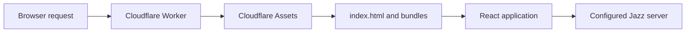
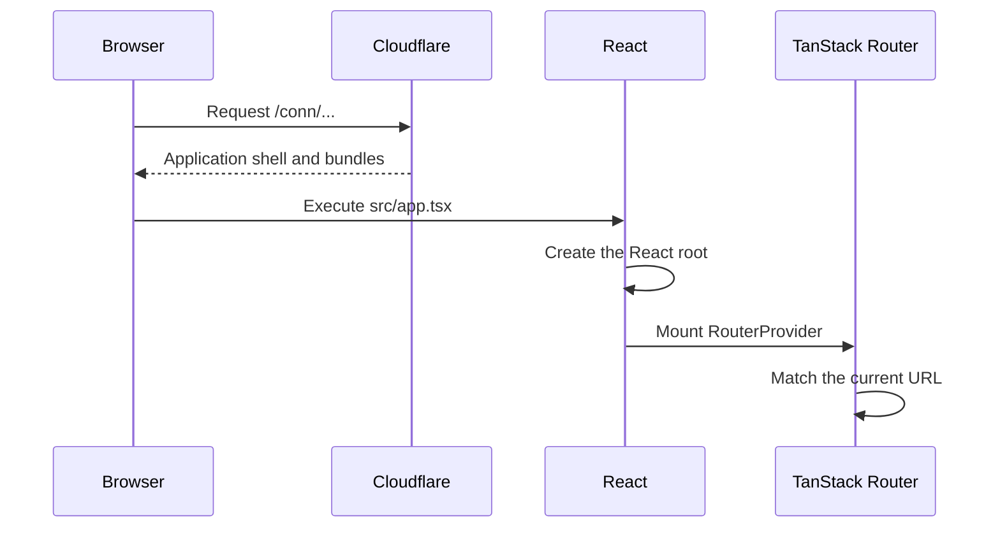
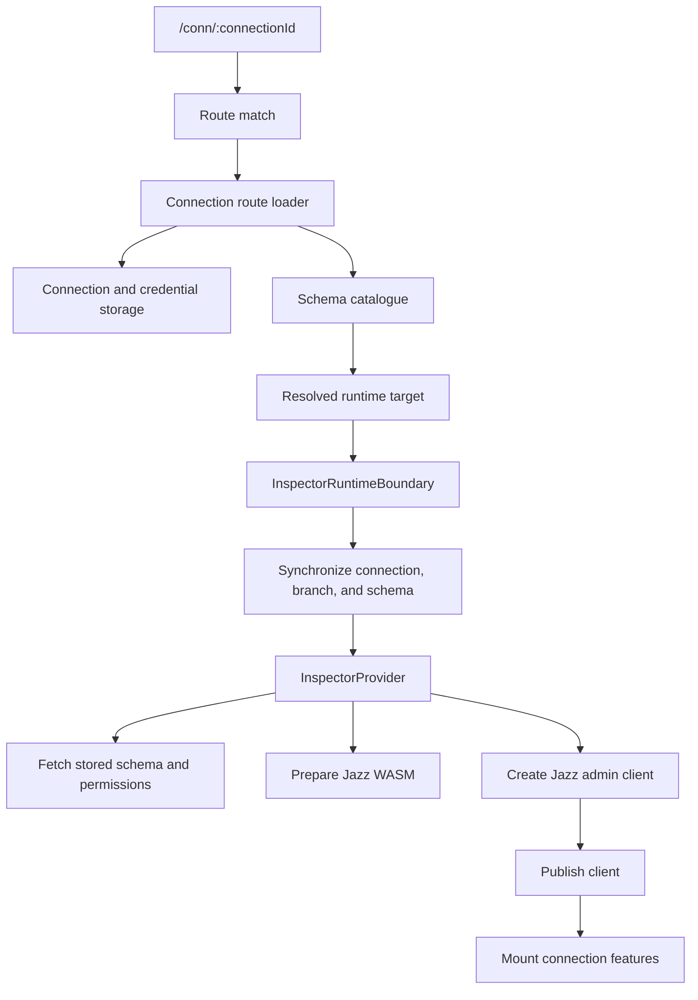
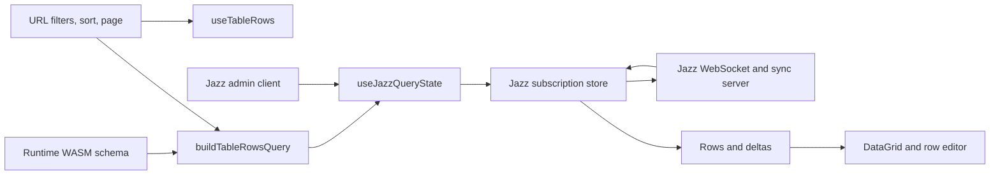

# Studio browser data flow

Studio uses a browser-based React application to connect inspected apps to Jazz and present their data.

## Table of contents

This contents list covers the browser, runtime, routing, and data layers described in this document.

- [System boundary](#system-boundary)
- [Application structure](#application-structure)
- [Initial page load](#initial-page-load)
- [Connection startup](#connection-startup)
- [Table data flow](#table-data-flow)
- [Navigation](#navigation)
- [Ownership map](#ownership-map)
- [Runtime invariants](#runtime-invariants)

## System boundary

The Cloudflare Worker serves the application shell and static assets. The browser runs the React application, resolves routes, manages runtime state, and connects to Jazz.



The Worker delegates asset requests to `env.ASSETS`. [[apps/studio/worker/productRequest.ts#handleProductRequest]] supplies the application-shell fallback for connection routes and applies the cache policy.

Hashed files under `/conn/assets/` can use immutable caching. The application shell uses `no-store` so a new load can reference the current bundles.

## Application structure

The browser application keeps route state, connection state, Jazz runtime state, and table state in separate layers.

```mermaid
flowchart LR
  Entry["src/app.tsx"] --> Root["React root"]
  Root --> Router["TanStack Router"]
  Router --> Routes["Route tree"]
  Routes --> Loader["Connection route loader"]
  Routes --> Session["InspectorSessionProvider"]
  Loader --> Boundary["InspectorRuntimeBoundary"]
  Session --> Boundary
  Boundary --> Runtime["InspectorProvider"]
  Runtime --> RuntimeStore["Inspector runtime store"]
  Runtime --> Client["Jazz admin client"]
  RuntimeStore --> TableUI["Table explorer"]
  TableUI --> Query["useTableRows"]
  Query --> QueryState["useJazzQueryState"]
  QueryState --> SubscriptionStore["Jazz subscription store"]
```



The session provider owns connection intent, persisted connection selection, and branch or schema selection. The runtime boundary synchronizes the route target with that session state. The runtime provider owns the active Jazz client and its lifecycle. Table features consume the runtime projections and own table queries and presentation.

## Initial page load

The browser loads the application shell, starts React, and lets TanStack Router select the current route.



The browser entry point is [[apps/studio/src/app.tsx]]. The document request is handled by [[apps/studio/worker/productRequest.ts#handleProductRequest]]. Route loaders and components then fetch the metadata needed for the selected connection.

## Connection startup

Connection startup resolves a stored target, prepares the Jazz runtime, creates a privileged client, and publishes that client to the connection-scoped features.



The route resolves a complete target through [[apps/studio/src/routes/conn/$connectionId.tsx#Route]]. [[apps/studio/src/app/routing/inspectorNavigation.ts#resolveStoredRuntimeTarget]] combines the stored connection with the selected schema metadata.

The onboarding layout starts shared WASM preparation after it commits. Form submission starts the same shared preparation while it fetches the schema catalogue. Direct connection routes and connection switching also start preparation before the runtime needs it. [[apps/studio/src/app/runtime/jazzWasmPreparation.ts#prepareJazzWasm]] returns one shared promise, so these entry points reuse one preparation attempt.

`InspectorProvider` waits for that promise before creating the admin client. It publishes the client only after the selected schema is verified. A failed, replaced, or unmounted runtime shuts down any client that resolves after it is no longer current.

Creating the client does not open the Jazz WebSocket. Jazz creates the native runtime and transport when the first schema-bound subscription is registered.

## Table data flow

Table rows come from a schema-driven Jazz subscription. The table query uses route state and runtime schema metadata, so the same code can inspect arbitrary supported tables.



[[apps/studio/src/features/tables/query/useTableRows.ts#useTableRows]] derives the table columns and query from route state and the runtime schema. [[apps/studio/src/features/tables/query/tableRowsQuery.ts#buildTableRowsQuery]] builds the generic query. [[apps/studio/src/features/tables/query/useJazzQueryState.ts#useJazzQueryState]] connects React to Jazz's external subscription store through `useSyncExternalStore`.

The table uses the remote read tier. A fresh admin client waits for the serving authority to provide the requested rows or a confirmed empty result. The maintained subscription remains the row source after the first result and publishes later changes.

Pagination requests one extra row to determine whether another page exists. Sorting, filtering, page changes, schema changes, table changes, or client changes acquire the matching subscription entry. The subscription store reuses equivalent entries and releases them when React cleanup removes the last listener.

## Navigation

Studio uses full page loads for document requests and client-side navigation for changes inside the running application.

### Full page load

The browser loads the application shell before React starts the connection runtime.

```text
browser
  -> Cloudflare Worker
  -> application shell and bundles
  -> React root
  -> route loader
  -> runtime metadata and client
  -> table subscription
  -> table rows
```

### Client-side navigation

```text
user action
  -> TanStack Router changes the URL
  -> the existing React tree remains mounted
  -> route or search state changes
  -> affected components render again
  -> Jazz reuses or creates the matching subscription entry
```

Client-side navigation keeps connection-scoped providers alive while the route selects another table, branch, schema, or view. A runtime target change intentionally replaces the affected client and its subscriptions.

## Ownership map

Each layer owns one boundary in the browser-to-Jazz data path.

| Entity | Owns | Does not own |
| --- | --- | --- |
| Cloudflare Worker | Application shell, static assets, fallback handling, and cache headers | React state or Jazz data |
| TanStack Router | URL matching, route loaders, and client navigation | Jazz client lifecycle |
| `InspectorSessionProvider` | Connection intent, persisted selection, branch and schema selection, and navigation guards | Jazz client lifecycle |
| `InspectorRuntimeBoundary` | Route-target and session synchronization | Table queries and rendering |
| `InspectorProvider` | Jazz client, WASM preparation, runtime errors, cleanup, and retry | Table-specific UI |
| Jazz client | In-memory runtime, transport, and remote operations | React rendering |
| Jazz subscription store | Query identity, cache entries, reference counting, and live deltas | URL state and layout state |
| React | Rendering, lifecycle, and external-store subscriptions | Remote persistence |
| Table features | Schema-driven queries, table presentation, and mutations | Connection discovery |

## Runtime invariants

Studio treats route, connection, schema, network, and React lifecycle changes as normal runtime events.

Components must derive observable behavior from current route and runtime state. They must not retain stale async work, publish a client for an old target, or keep a subscription after React cleanup.

The runtime guarantees include:

- route loaders can be aborted;
- stale async work cannot update the active runtime;
- provider cleanup shuts down owned Jazz clients;
- external data uses lifecycle-safe subscriptions;
- provider ancestry changes can restart runtime resources;
- client creation and WebSocket connection do not prove authenticated query readiness.

The connection startup phases are detailed in [[runtimeConnectionStartup#Connection startup phases]].
